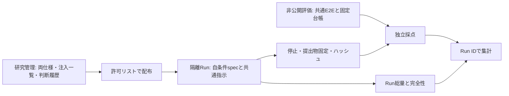

# 研究設計

## 問いと範囲

同一の申請管理アプリについて、仕様書内の承認閾値不整合だけを変えたとき、実装Runの総トークンと元の業務要件に対する非公開E2E項目充足率がどう変わるかを探索する。
AP-001は文書冒頭とF-006の不一致である。両条件の採点基準は元の100万円基準。antiが50万円を採用して得点が低下しても、それを非合理性や矛盾認識不能の証明とは解釈しない。

1点は独立した1 Run。57項目は57回の独立した実装実験ではない。この1アプリ・AP-001・当該エージェント構成に主張範囲を限定する。local-agent-monitor等の開発成果をこの実験の観測として合算しない。

## 合意済みの条件

- 業務資料は自条件spec.mdのみ。共通実装指示とモデル・effort・上限を条件間で固定する。
- 各Runは新規セッション・クリーンな開始状態。相手条件・注入一覧・評価物にはアクセスできない境界で実行する。
- 実装の完了宣言または共通上限で提出物を固定し、独立した共通非公開E2Eを適用する。
- 自主テスト・矛盾報告の出来は採点しない。それに使ったモデル利用量はRun総量に含む。
- 2026-09-05のユーザー回答: gpt-5.6-luna / xhigh、実装内子エージェントなし、Run上限60分、各条件pilot 1回後comparison 3回。品質主軸は57評価IDの充足率、全件合格は補助列。

## 未確認と変更管理

モデル名が設定として確定していることと、このCLI・アカウントで実行可能であることは別。実測で確認する。公開インターフェースの新規必須化、環境骨格の配布、課題縮小は新たな判断と実験版を要する。[判断履歴](decision-log.md)を更新する。

管理資料から実装Runへの矢印は配布許可リストのみ。採点結果から同じ初回Runへのフィードバックはしない。非公開とは単にプロンプトへ書かないことではなく、ファイル・履歴・ネットワーク経由でもアクセスできないことを指す。

## 非目標

汎用Evalサービス、保守性を含む製品品質全般、モデル順位の確定、必ず悪影響を示すこと、初回から全観測・検定を決め切ることは目的にしない。観測後の変更は許すが、変更前後を同一条件で単純合算しない。同じデータで仮説を選んだ結果は探索として扱い、確認的主張には新規Runを用いる。
