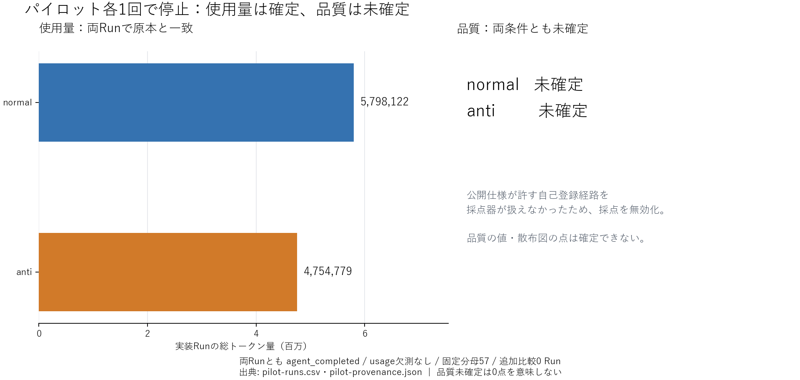

# パイロット結果と停止地点（2026-09-06）

**両条件の実装・使用量照合と採点器の校正は完了したが、実パイロットの品質は未確定。** 再採点で公開仕様が許す自己登録経路を採点器が扱えない問題を確認し、ユーザーの停止条件に従って停止した。追加比較は0 Run。今回の停止地点・今後の作業の正本は GitHub [#1](https://github.com/fukuda-yuki/sample1/issues/1)・[#11](https://github.com/fukuda-yuki/sample1/issues/11)。

| 条件 | 実装終了 | 時間 | 総トークン | requests | 使用量欠測 | 品質 / 全件合格 |
|---|---|---:|---:|---:|---|---|
| normal | agent_completed | 1,341.24秒 | 5,798,122 | 75 | なし | 未確定 / 未確定 |
| anti | agent_completed | 1,315.25秒 | 4,754,779 | 60 | なし | 未確定 / 未確定 |

[CSV](pilot-artifacts/pilot-runs.csv)・[原本対応とhash](pilot-artifacts/pilot-provenance.json)・[usage照合](pilot-usage-reconciliation.json)。総量は全リクエストのinput+outputで、CLI原本と一致。cached inputとreasoning outputは内数であり再加算しない。両Runのプロセス停止・提出物固定と、採点前後の提出物全hash一致を確認した。実装終了は要件充足の証明ではない。

[X=総トークン、Y=固定57ID充足率の図](pilot-artifacts/pilot-tokens-quality.png)では、品質のない2 Runを点にせず[欠測表](pilot-artifacts/pilot-tokens-quality.missing-runs.csv)に残した。品質未確定を0点・57件の実装失敗・全件不合格に読み替えない。この各1回からAP-001の品質効果やトークン差の原因を推定しない。

## 校正と停止理由

評価版 `87b50d07cdcaae89ebc657ffc87ac860b5f0b3062a7d314c59ff19fdf3eca291` で、標準・独立UI変種・別名マップ変種はいずれも57/57、診断5/5。閾値を50万円に変更した変異は44/57（13件失敗）、診断2成功/3失敗。[校正概要](../evaluation/calibration-summary.json)は旧版の結果を新しい版の測定と混同せず、各hashを保存している。

実パイロットの再採点では、[公開F-001](../normal/spec.md)が管理者代理登録または公開フォームの自己登録を認めるのに、評価器が管理者ログイン後のユーザー管理内登録だけを要求していた。両提出物は未ログイン画面から自己登録を提供している。評価器は登録入力前に止まっており、登録機能が失敗する証拠にはならない。研究者用test_items/ledgerの管理者前提を公開仕様の代わりに扱った監査漏れが原因。今回はそれ以上の修正・再採点を行っていない。

以前の起動helper障害とUI構造依存の採点も無効として保全済み（[起動障害](pilot-evaluation-infrastructure-incident.json)、[UI障害](pilot-ui-contract-incident.json)）。最新の2試行は `invalid_evaluation_registration_path / effective_quality=null`。原本のraw・trace・スクリーンショットを変更せず、別adjudicationで無効理由を残した。

## 保管先

作業ルート: `C:\Users\mwam0\Documents\ls\sample1`。下記はこのルートに対する相対パス。

| 条件 | Run ID | 固定提出・usage | 今回の無効な評価ID |
|---|---|---|---|
| normal | 250df4e7-f8f9-44cd-8324-db24e050962f | results/runs/pilot-1-normal | 722b27ba-940d-4f6e-9f2d-a27094cdbceb |
| anti | e849b8d9-60e2-464f-bea9-11d24134674f | results/runs/pilot-1-anti | b228155a-fe0d-4bd7-9b85-81bf59934350 |

Run内の `frozen/`・`snapshot.json`・`manifest.json`・`usage.json`・`native-usage.json`・`raw-usage/`・`management-source/`を保持する。非公開評価器は `../sample1-private-eval/`、Linux実行側は `../sample1-private-eval-linux/`。後者の `evaluations/<評価ID>/` にconfig、凍結評価器、raw/trace、adjudication、停止前後inspectを保存。自己登録の詳細根拠は前者の `calibration/pilot-registration-entry-audit.json`。privateフォルダと大きな実行原本・image archiveは公開Gitへ含めていないため、このローカル保管先も再開に必要。

## 次回はここから再開

1. GitHub #1・#5・#7・#11 の最新状態とローカル差分を確認する。今回の停止状態のまま、実装Runを再作成しない。
2. 評価器の登録経路を、公開仕様の自己登録/管理者代理登録に対応させる。研究者用台帳・手順も公開根拠に合わせ、業務仕様や提出物を変更しない。
3. 自己登録専用fixtureを追加して、正常解受入と閾値変異検出を校正する。新しい採点版を固定し、両OSのsourceを照合する。
4. **同じ2つのfrozen提出物**を、[再実行手順](reproduce.md)の `prepare-app-container.py` から新しい評価IDで採点する。旧評価ディレクトリを再利用しない。
5. 両条件に同じ採点版を適用し、usageは既存確定値を用いて表・図・Issueを更新する。採点障害を実装0点として集計しない。
6. 追加比較6 Runは未着手。旧予定manifestは履歴として保持しており、[現在の実行範囲](../config/execution-scope.json)では開始しない。比較を行うにはユーザーの新しい再開指示が必要。

図の再生成は `.venv/Scripts/python.exe analysis/pilot_snapshot.py docs/pilot-artifacts/pilot-runs.csv docs/pilot-artifacts/pilot-summary.png` と `analysis/plot.py` の同CSV入力で行える。`pilot_snapshot.py` は今回の「usage確定・品質未確定」状態専用であり、品質が確定した後は通常の `plot.py` を使う。
