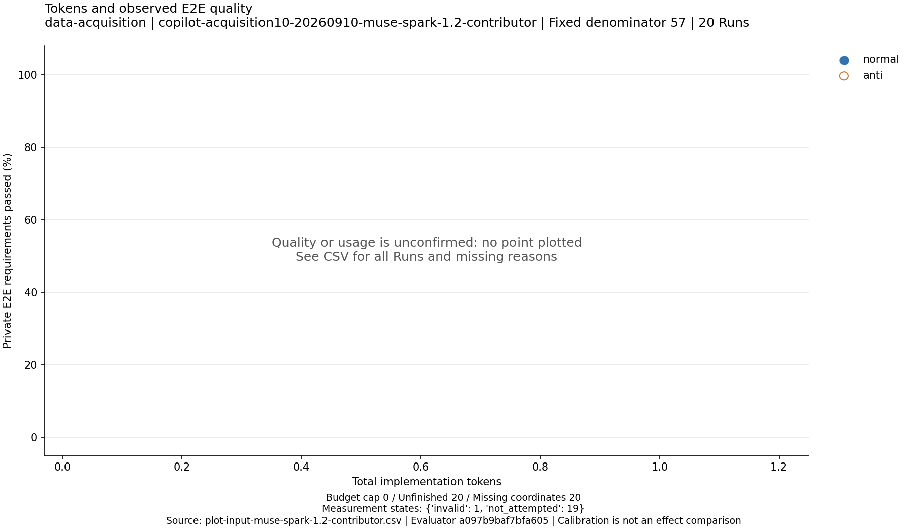

# normal/anti各10開始の実験レポート

## 結果と判断

予定20開始に対して、実際の開始は1件、runnerの通常終了は0件、その他の終了は1件、未開始は19件です。normalは未開始で、normal/antiの比較は成立していません。

| 条件 | 予定 | 開始 | 通常終了 | その他終了（raw agent_error） | 未開始 |
| --- | --- | --- | --- | --- | --- |
| normal | 10 | 0 | 0 | 0 | 10 |
| anti | 10 | 1 | 0 | 1 | 9 |

使用モデルはMuse Spark 1.2 Contributorの1件だけです。1.3 Contributor・Omen Alpha・MiMo-V2.5は各0件で、503による代替は発生していません。

anti-001には明示的な実装完了宣言がありましたが、バックグラウンドnpmが残ってCLIが終了しませんでした。管理担当が宣言と所有IDを記録してSIGKILLで停止したため、raw終了分類はagent_error / exit 137です。これをモデルが実装を失敗した証拠とは扱いません。停止後にnative親spanの欠落257件を確認し、残19枠を停止しました。停止操作と未flushの因果は未検証です。

127件のHTTP200応答とnative callの対応・monitor readbackは確認できていますが、usage完全性はfalseです。観測下限7,168,678 tokensを確定総量へ昇格させず、総量はnullのまま保持しました。今回の主な未達はデータ取得の停止であり、仕様条件間の効果を評価できる標本を取得できていません。

初回v6採点は1件終了し、rawは32/57合格（56.14%）、17失敗、8前提blockedでした。通常UI確認で評価側の操作制約を確認したため、この評価の妥当性はinvalid、有効品質はnullです。評価状態の内訳は `{'invalid': 1}` です。有効品質や使用量が確定しないRunを0へ置換していません。

## 比較単位と評価値の定義

1観測は独立した実装Runです。normal/antiの差は仕様書内F-006の承認閾値不整合AP-001。元の100万円基準で57評価ID・58必須ケースを等配点評価し、1 IDの必須ケース全成功で1点とします。自主テストや矛盾報告は加点しません。57 IDは全仕様の網羅性を保証しません。

総トークンはgatewayのinput+outputをnative telemetryとmonitor取込後に照合したRun総量です。キャッシュ入力やreasoningを別途二重加算しません。欠測時はtotal_tokens=nullと観測下限を保持します。品質は妥当性裁定が有効な場合だけ100×合格ID数/57。rawは評価器の操作結果であり、実装責任の確定ではありません。

## モデル別・条件別の観測

| モデル | 条件 | 開始 | 使用量確定n | 平均token | 中央値token | 最小–最大token | 有効品質n | 平均品質% | raw採点n | raw平均% |
| --- | --- | --- | --- | --- | --- | --- | --- | --- | --- | --- |
| muse-spark-1.2-contributor | normal | 0 | 0 | 未取得 | 未取得 | 未取得–未取得 | 0 | 未取得 | 0 | 未取得 |
| muse-spark-1.2-contributor | anti | 1 | 0 | 未取得 | 未取得 | 未取得–未取得 | 0 | 未取得 | 1 | 56.14 |

平均・中央値は列ごとの非欠測Runだけを使っています。分母nを併記し、成功Runだけへの選別は行っていません。代替モデルは1.2の条件差推定へ混ぜません。

有効品質の中央値・最小・最大も両条件とも未取得です。参考raw合格率はantiの1件だけなので、平均・中央値・最小・最大はいずれも56.14%。分布を推定できる標本数ではありません。

## Muse Spark 1.2の条件差

| 指標 | anti − normal |
| --- | --- |
| 総token平均差 | 未取得 |
| 総token中央値差 | 未取得 |
| 有効品質平均差（percentage points） | 未取得 |
| raw合格率平均差（参考、percentage points） | 未取得 |

条件差はこのアプリ・AP-001・実行構成に限定した記述統計です。欠測群と有効群の構成が異なる場合、単純な平均差は同じ標本間の比較ではありません。代替は503に条件付けられており、モデル間の優劣比較にも使えません。

図は1点1 Run、Y軸は固定分母57です。座標のいずれかが未確定なら描画せず、欠測表へ残します。点がない場合は差なしではなく、座標が成立する観測がないことを意味します。

## Run一覧と原本への対応

| 枠 | Run UUID | モデル | 終了理由 | 総token | raw合格 | 有効品質% | 測定状態 |
| --- | --- | --- | --- | --- | --- | --- | --- |
| anti-001 | 256a2bf5-a8db-4a43-81bc-17bc38eda0d3 | muse-spark-1.2-contributor | agent_error | 未確定 | 32/57 | 未確定 | invalid |
| normal-001 | 未開始 | muse-spark-1.2-contributor | 未開始 | 未確定 | 未採点 | 未確定 | not_attempted |
| normal-002 | 未開始 | muse-spark-1.2-contributor | 未開始 | 未確定 | 未採点 | 未確定 | not_attempted |
| anti-002 | 未開始 | muse-spark-1.2-contributor | 未開始 | 未確定 | 未採点 | 未確定 | not_attempted |
| anti-003 | 未開始 | muse-spark-1.2-contributor | 未開始 | 未確定 | 未採点 | 未確定 | not_attempted |
| normal-003 | 未開始 | muse-spark-1.2-contributor | 未開始 | 未確定 | 未採点 | 未確定 | not_attempted |
| anti-004 | 未開始 | muse-spark-1.2-contributor | 未開始 | 未確定 | 未採点 | 未確定 | not_attempted |
| normal-004 | 未開始 | muse-spark-1.2-contributor | 未開始 | 未確定 | 未採点 | 未確定 | not_attempted |
| normal-005 | 未開始 | muse-spark-1.2-contributor | 未開始 | 未確定 | 未採点 | 未確定 | not_attempted |
| anti-005 | 未開始 | muse-spark-1.2-contributor | 未開始 | 未確定 | 未採点 | 未確定 | not_attempted |
| normal-006 | 未開始 | muse-spark-1.2-contributor | 未開始 | 未確定 | 未採点 | 未確定 | not_attempted |
| anti-006 | 未開始 | muse-spark-1.2-contributor | 未開始 | 未確定 | 未採点 | 未確定 | not_attempted |
| normal-007 | 未開始 | muse-spark-1.2-contributor | 未開始 | 未確定 | 未採点 | 未確定 | not_attempted |
| anti-007 | 未開始 | muse-spark-1.2-contributor | 未開始 | 未確定 | 未採点 | 未確定 | not_attempted |
| anti-008 | 未開始 | muse-spark-1.2-contributor | 未開始 | 未確定 | 未採点 | 未確定 | not_attempted |
| normal-008 | 未開始 | muse-spark-1.2-contributor | 未開始 | 未確定 | 未採点 | 未確定 | not_attempted |
| anti-009 | 未開始 | muse-spark-1.2-contributor | 未開始 | 未確定 | 未採点 | 未確定 | not_attempted |
| normal-009 | 未開始 | muse-spark-1.2-contributor | 未開始 | 未確定 | 未採点 | 未確定 | not_attempted |
| anti-010 | 未開始 | muse-spark-1.2-contributor | 未開始 | 未確定 | 未採点 | 未確定 | not_attempted |
| normal-010 | 未開始 | muse-spark-1.2-contributor | 未開始 | 未確定 | 未採点 | 未確定 | not_attempted |

機械可読の全行と欠測理由は[runs.csv](runs.csv)、[runs.json](runs.json)、[summary.json](summary.json)に収録しました。評価UUID・提出hashから研究者用保管庫の原本へ対応できます。私的ケース・画面・traceは公開していません。

## 実行・保全方法

seed=20260910で10ペアの条件順を事前固定し、各3600秒、effort未指定、実装子agentなし、K=1・dispatch limit=1で実行しました。各Runは新規セッション・隔離環境で自条件specと共通契約だけを受け取ります。失敗や時間切れも枠を消費し、低得点を取り直しません。

上流503時だけ次の同条件枠で1.3→Omen→MiMoへ進む方針です。拒否自体のusage未提供はnullを維持し、成功応答の照合欠損とは区別します。継続的429、停止回収・保全・計測障害、代替全滅では新規開始を停止します。

固定ソース・実配布入力・設定・CLI/image・管理コード・ログ・raw usage・telemetry・評価原本は独立保管庫へ保存しました。採点は固定v6で実装終了後に行い、原本を変更していません。保全・復元・集計の実測状態は[verification.json](verification.json)を参照してください。

## 制約、原因分類、次に確認すべきこと

v6には同名ボタン探索、遅延遷移との競合、時計・直近5件の交絡などの既知事項があります（Issue #39/#40/#42/#43）。raw fail/blockedを直ちに実装不備と断定せず、前提波及・評価側判定不能・未到達を別列で報告します。個別の証拠確認結果は[assessment.md](assessment.md)を参照してください。

完了宣言とプロセス終了・telemetry flushの不一致は[Issue #45](https://github.com/fukuda-yuki/sample1/issues/45)へ記録しました。最終idleで停止する候補の単体検査と合成プロセスのDocker検査だけでは、実CLIの親span flushを保証できません。候補は保管しましたがproductionには適用していません。次の再開前には実CLI＋合成providerでこの境界を確認する必要があります。

有効品質が不足する場合の次の判断は、保存済みの同一提出物を改善評価版で再採点することです。得点や分母を都合よく変えたり、生成物を修正して今回のRunへ付け替えたりしません。この20開始の枠から追加実装は行いません。

再採点時は旧評価UUIDとraw・裁定を保存し、評価版と新UUIDを固定して同一提出hashを採点します。[今回の復元・再集計・再採点手順](reproduce.md)、[実行契約](../../docs/serial-acquisition-10.md)、[Issue #44](https://github.com/fukuda-yuki/sample1/issues/44)を参照してください。元データへのアクセスを拒否した復元環境でCSV・JSONとSQLite 5テーブルの再集計一致を確認しました。
