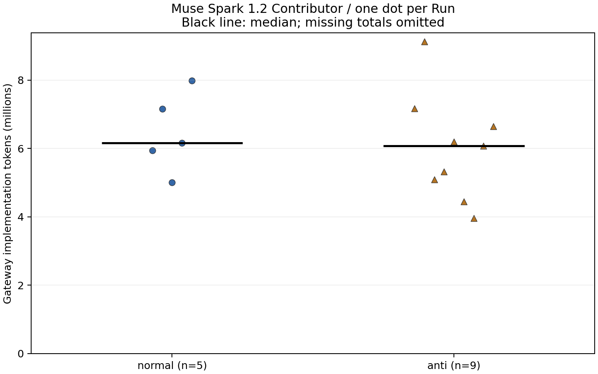
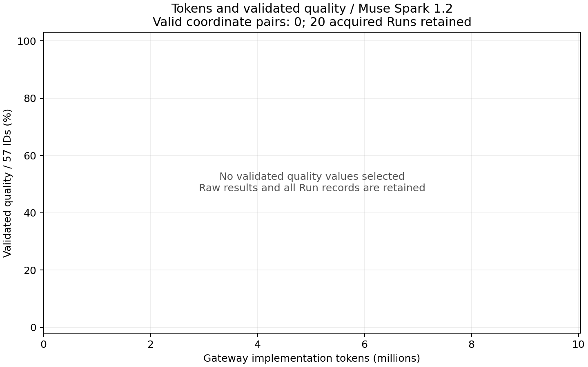
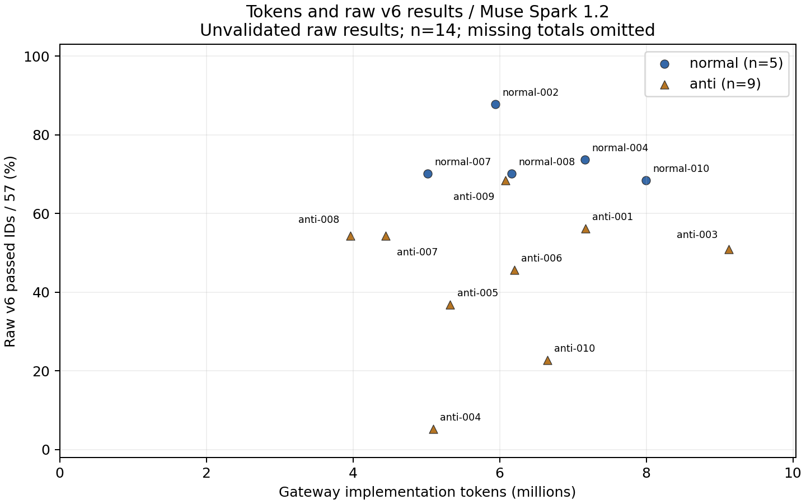

# 原本保持を優先したnormal/antiデータ取得

予定20開始に対し、開始20件、回収・保全20件、未開始0件です。既存anti 1件を保持し、同じ予定表で残枠を実行しました。失敗や測定欠損を理由とする取り直し・削除はありません。

最初のantiも原本を変更せず再利用し、保存済みgateway記録から7,168,678 tokensを照合しました。旧usageのnull値と親span欠落の記録を残し、選択した新処理の結果を追加しています。

## 取得と検証の状態

seed 20260910で固定した10ペアの予定順を用い、各Runは新規セッション・隔離環境、上限60分、effort未指定、実装子エージェントなしで実行しました。同時実装数は1です。配布入力は自条件specと共通契約のみ。AP-001、57評価ID・58ケース・等配点を維持しています。

| 条件 | 予定 | 開始 | 回収 | 通常終了 | その他終了 | 未開始 |
| --- | --- | --- | --- | --- | --- | --- |
| normal | 10 | 10 | 10 | 10 | 0 | 0 |
| anti | 10 | 10 | 10 | 9 | 1 | 0 |

通常終了はrunnerのagent_completed。最初のantiは完了宣言後の管理停止でraw agent_error/137を保持しています。再開後に完了宣言を検出して管理停止したRunは、実際の終了コードと停止理由・宣言の記録を分けました。取得完了は有効採点の完了を意味しません。

| モデル | 開始件数 |
| --- | --- |
| muse-spark-1.2-contributor | 20 |

評価実行終了は20件、有効品質が確定した評価は0件です。既存antiのv6 raw 32/57、invalid裁定を保持しました。未採点・未確定の提出物もすべて保存され、同一提出hashで評価器を更新できます。

1.2の確定token平均はnormal 6,455,265.2（n=5）、anti 6,005,891.2（n=9）でした。raw v6 pass率の平均差はanti − normalで-25.3ポイントです。tokenの欠測件数が条件間で異なり、評価妥当性も未確定のため、この数値だけで効率や品質の優劣は判断しません。

全実装の停止後、再開分19件の初回v6評価を独立したアプリ・DB・評価コンテナで最大4件ずつ実行しました。評価中の実装エージェント数は0です。評価の実行順・UUID・準備記録も保持し、実装の直列条件と評価の実行条件を分けて記録しています。

## 条件別の記述統計

単位は1 Runです。総token確定値はgatewayで開始・終端・usageが揃ったRunのみ。有効品質は妥当と裁定した評価の57 ID等配点です。未確定Runは分母へ混ぜず、各指標のnを併記します。原本を保存している件数とは異なります。

| モデル | 条件 | 開始n | 総token確定n | 平均 | 中央値 | 最小 | 最大 |
| --- | --- | --- | --- | --- | --- | --- | --- |
| Muse 1.2 | normal | 10 | 5 | 6,455,265.2 | 6,165,950.0 | 5,014,337.0 | 7,991,897.0 |
| Muse 1.2 | anti | 10 | 9 | 6,005,891.2 | 6,079,458.0 | 3,965,456.0 | 9,125,827.0 |

| 1.2のanti − normal | 差 |
| --- | --- |
| 総tokenの平均差 | -449,374.0 |
| 総tokenの中央値差 | -86,492.0 |
| 観測下限の平均差 | -825,262.1 |
| 観測下限の中央値差 | -1,108,274.0 |
| raw v6平均差（ポイント） | -25.3 |
| raw v6中央値差（ポイント） | -17.5 |
| 有効品質の平均差（ポイント） | 未確定 |
| 有効品質の中央値差（ポイント） | 未確定 |

| 同じ予定ペア内のanti − normal | 対応が揃うペアn | 差の平均 | 差の中央値 |
| --- | --- | --- | --- |
| 総token | 4 | -1,546,420.5 | -1,707,381.0 |
| 有効品質（ポイント） | 0 | 未確定 | 未確定 |
| raw v6 pass率（ポイント） | 10 | -25.3 | -21.1 |

総tokenが双方で確定した4ペアでは、antiが少ないペアが4、同量が0、多いペアが0でした。残る6ペアには欠測があり、有効品質も未確定です。この観測を品質を維持した効率改善とは解釈できません。

ペア内比較も両方が1.2で、対象指標が観測できたペアだけです。raw v6の差は未裁定の評価器出力差です。10ペア以下の探索データとして記述し、欠測や評価制約が残る段階で有意差・優劣を主張しません。

総tokenが未確定のRunは6件あります。確定値だけの平均・中央値は欠測の影響を受けるため、全Runの条件差として扱えません。観測できたtokenの合計は134,321,987で、欠測がある場合は総消費の下限です。

| モデル | 条件 | 観測token n | 観測下限の平均 | 観測下限の中央値 |
| --- | --- | --- | --- | --- |
| Muse 1.2 | normal | 10 | 7,128,730.4 | 7,248,219.0 |
| Muse 1.2 | anti | 10 | 6,303,468.3 | 6,139,945.0 |

観測下限同士の差は、真の総消費量の条件差に対する上限・下限にはなりません。条件ごとの欠測件数と併せ、保存済み観測値の記述統計として扱います。

| モデル | 条件 | 有効品質n | 品質平均% | 品質中央値% |
| --- | --- | --- | --- | --- |
| Muse 1.2 | normal | 0 | 未確定 | 未確定 |
| Muse 1.2 | anti | 0 | 未確定 | 未確定 |

総トークンは実装gatewayの開始・終端・usageを照合したinput+outputで、研究管理・採点の計算量は対象外です。native call対応、親span構造、monitor状態は独立項目です。キャッシュ入力・reasoningを二重加算しません。欠測はnullと観測下限を残します。有効品質が未確定なら散布図の点を描きません。

今回のmonitor照合は、専用DBへのrawデータの取込と読戻しです。通常のMonitor UIや派生trace表示の受入検証までを測定範囲に含めていません。専用DBの整合したsnapshotも非公開の管理証拠として保管しています。

| 条件 | Run n | 総token欠測Run | native未確認Run | 親span不完全Run | 400発生Run | HTTP 400応答数 |
| --- | --- | --- | --- | --- | --- | --- |
| normal | 10 | 5 | 5 | 1 | 5 | 25 |
| anti | 10 | 1 | 1 | 4 | 1 | 4 |

上流400を含むRunでも取得・保存は続けました。エラー応答にusageがない場合、総量の完全性は未確定です。Run数とHTTP応答数を分け、欠測を除いた比較の偏りを残る制約として扱います。詳細は[measurement-profile.json](measurement-profile.json)とIssue #47にあります。

## v6のraw結果と評価範囲

| モデル | 条件 | raw結果n | raw pass率平均% | 中央値% | 最小% | 最大% |
| --- | --- | --- | --- | --- | --- | --- |
| Muse 1.2 | normal | 10 | 70.5 | 70.2 | 54.4 | 87.7 |
| Muse 1.2 | anti | 10 | 45.3 | 52.6 | 5.3 | 68.4 |

raw pass率は初回v6が返したpass ID数/57です。評価器の操作制約・前提未成立・未到達も含むため、製品品質とは区別します。raw差をnormal/antiの品質差と解釈せず、通常UIの証拠と再採点を使って検証するための基準記録として保持します。ケース別raw状態・到達範囲・既存裁定はCSVのcoverage_jsonとSQLiteにあります。

| 条件 | 評価終了Run | 要求ケース | 業務判定へ到達 | 前提未成立でblocked |
| --- | --- | --- | --- | --- |
| normal | 10 | 580 | 486 | 50 |
| anti | 10 | 580 | 352 | 127 |

以下はケース単位の原因分類です。原因裁定のないraw passケース（none）は表から省いています。未裁定の非passケースは「原因未確定」に含めます。

| 条件 | 裁定済み実装原因 | 評価器原因 | 評価環境原因 | 指示の曖昧さ | 原因未確定 |
| --- | --- | --- | --- | --- | --- |
| normal | 1 | 0 | 0 | 0 | 167 |
| anti | 0 | 2 | 0 | 3 | 310 |

到達数は保存済みケース記録に基づきます。評価側原因の裁定は通常UI等で確認した範囲に限定し、未裁定を実装失敗へ振り替えません。詳しい分類は[evaluation-coverage.json](evaluation-coverage.json)に保持しています。

準備記録の要約は[evaluation-preparation.json](evaluation-preparation.json)です。resetとUIログインによるseed観測の件数をRunごとに残しています。準備記録だけで採点妥当性を認定してはいません。

AP-001との直接関係が台帳に定義されたT-006群と、前提経路への影響が記載されたT-010-01を次に示します。各セルはケース単位のpass / fail / blocked / error件数です。T-006-05は各Runに2ケースあるため、他の行とはケース数が異なります。追加の品質点や分母としては使いません。

| 評価ID | normal: P / F / B / E | anti: P / F / B / E |
| --- | --- | --- |
| T-006-01 | 10 / 0 / 0 / 0 | 0 / 8 / 2 / 0 |
| T-006-02 | 9 / 1 / 0 / 0 | 7 / 1 / 2 / 0 |
| T-006-03 | 10 / 0 / 0 / 0 | 0 / 8 / 2 / 0 |
| T-006-04 | 10 / 0 / 0 / 0 | 7 / 1 / 2 / 0 |
| T-006-05 | 20 / 0 / 0 / 0 | 7 / 9 / 4 / 0 |
| T-006-06 | 10 / 0 / 0 / 0 | 8 / 1 / 1 / 0 |
| T-010-01 | 4 / 6 / 0 / 0 | 0 / 8 / 2 / 0 |

blockedは前提未成立のraw状態で、すべての未到達を表すわけではありません。画面探索中の失敗などはfailにも含まれます。項目別集計は[ap001-raw-diagnostics.json](ap001-raw-diagnostics.json)、Run別の状態は[test-results.jsonl](test-results.jsonl)から追跡できます。

T-006-01とT-006-03は、normalが各10件pass、antiが各0件pass（8 fail・2 blocked）でした。これは閾値の解釈を再確認する対象です。一方、業務判定への到達はnormal 486/580、anti 352/580で異なります。anti全体の低いraw値をAP-001だけの効果や一般的な実装不具合へ帰属させることはできません。

確認済みの実装原因として、normal-002のT-002-02ではログアウトPOSTが200で成功した後も指定メッセージが表示されませんでした。固定ソースでは、遷移先で表示に必要なstate/queryを呼出側が渡していません。同じIDでも、初回antiのログインリンク探索の問題とは原因が異なります。この1項目の裁定で、他のログアウト要件や総合品質まで認定してはいません。画面・trace・ソースhashを結び付けた裁定を追加し、raw 50/57は保持しています。

## 保存・再利用

| Run枠 | 総token確定値 | 観測token | raw pass / 57 | 終了理由（raw） | 評価妥当性 |
| --- | --- | --- | --- | --- | --- |
| anti-001 | 7,168,678 | 7,168,678 | 32 / 57 | agent_error | invalid |
| normal-001 | 欠測 | 7,791,933 | 31 / 57 | agent_completed | pending |
| normal-002 | 5,938,760 | 5,938,760 | 50 / 57 | agent_completed | pending |
| anti-002 | 欠測 | 8,981,662 | 33 / 57 | agent_completed | pending |
| anti-003 | 9,125,827 | 9,125,827 | 29 / 57 | agent_completed | pending |
| normal-003 | 欠測 | 7,642,137 | 42 / 57 | agent_completed | pending |
| anti-004 | 5,091,795 | 5,091,795 | 3 / 57 | agent_completed | pending |
| normal-004 | 7,165,382 | 7,165,382 | 42 / 57 | agent_completed | pending |
| normal-005 | 欠測 | 7,257,799 | 42 / 57 | agent_completed | pending |
| anti-005 | 5,326,742 | 5,326,742 | 21 / 57 | agent_completed | pending |
| normal-006 | 欠測 | 9,080,470 | 37 / 57 | agent_completed | pending |
| anti-006 | 6,200,432 | 6,200,432 | 26 / 57 | agent_completed | pending |
| normal-007 | 5,014,337 | 5,014,337 | 40 / 57 | agent_completed | pending |
| anti-007 | 4,443,911 | 4,443,911 | 31 / 57 | agent_completed | pending |
| anti-008 | 3,965,456 | 3,965,456 | 31 / 57 | agent_completed | pending |
| normal-008 | 6,165,950 | 6,165,950 | 40 / 57 | agent_completed | pending |
| anti-009 | 6,079,458 | 6,079,458 | 39 / 57 | agent_completed | pending |
| normal-009 | 欠測 | 7,238,639 | 39 / 57 | agent_completed | pending |
| anti-010 | 6,650,722 | 6,650,722 | 13 / 57 | agent_completed | pending |
| normal-010 | 7,991,897 | 7,991,897 | 39 / 57 | agent_completed | pending |

[Run CSV](runs.csv)、[Run JSON](runs.json)、[SQLite](analysis.sqlite)、[統計JSON](summary.json)、[保全参照](retention.json)、[固定予定順](planned-runs.json)に対応を収録しています。独立保管庫はC:\Users\mwam0\ResearchArchives\sample1です。非公開評価器・画面・traceは公開Gitに含めません。

[集計確認Notebook](analysis-checks.ipynb)は同じフォルダのJSON・SQLiteだけで件数・参照関係・統計を再確認します。実行結果は[notebook-verification.json](notebook-verification.json)、レポートと管理証拠の独立保管・復元参照は[delivery-preservation.json](delivery-preservation.json)です。

各Runの入力、設定、CLI/image/管理版、開始終了、固定ソース・lockfile・hash、CLI応答、gateway usage、native telemetry、monitor照合を保持しています。評価時のコンテナ設定とテスト用メール出力も非公開の最終保管物に含めました。再開後はgateway応答ストリームも秘密情報を除いて保存しました。初回antiにはこの追加ストリーム保存がなく、取得済みCLI応答・usage・telemetryを保持しています。取得していない情報は後から捏造しません。

提出物に含まれる既知のlockfile名とhashもretention.jsonに収録しました。該当lockfileが確認できない提出物は0件です。lockfileがない場合も提出物を保持し、その不足を再評価環境の再構成時に考慮します。

## 解釈と残る作業

主比較はMuse Spark 1.2同士に限定し、代替モデルを混ぜません。各条件最大10開始、単一アプリ・AP-001の探索結果です。取得時期、初回と再開後の管理停止処理の差、provider障害、欠測を記録し、条件差を一般的な因果効果と断定しません。57 ID・58ケース・等配点は維持します。

計測器・評価器の不具合を修正した場合は、旧raw・処理・裁定を保持して新処理UUID/評価UUIDと明示的選択を追加します。生成物は変更せず、実装役への評価結果の返却もしません。必要な後処理と原本の復元・再集計証拠は[verification.json](verification.json)、手順は[再処理手順](reproduce.md)を参照してください。
