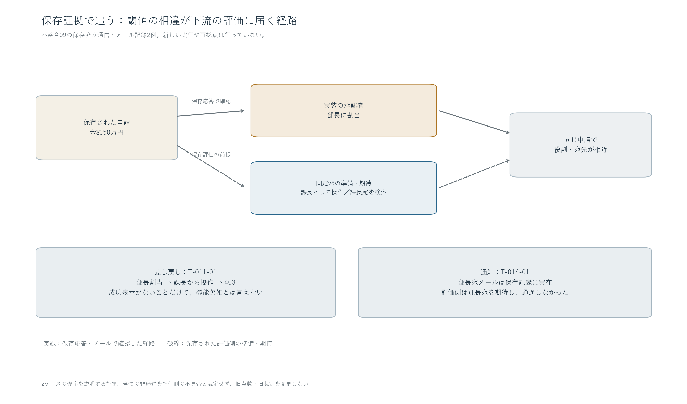
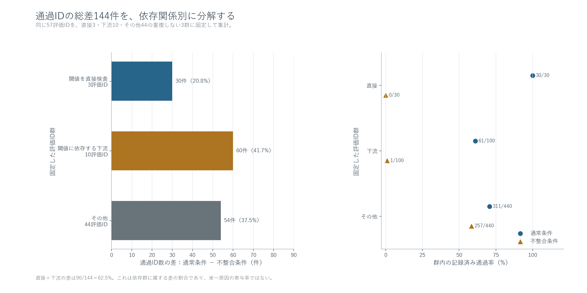
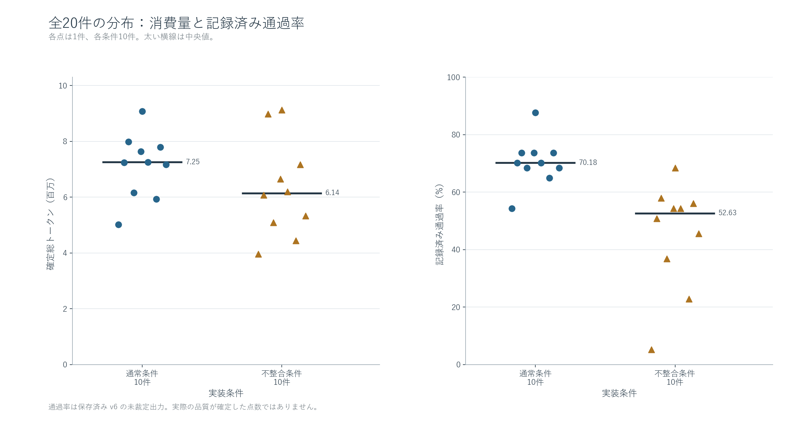
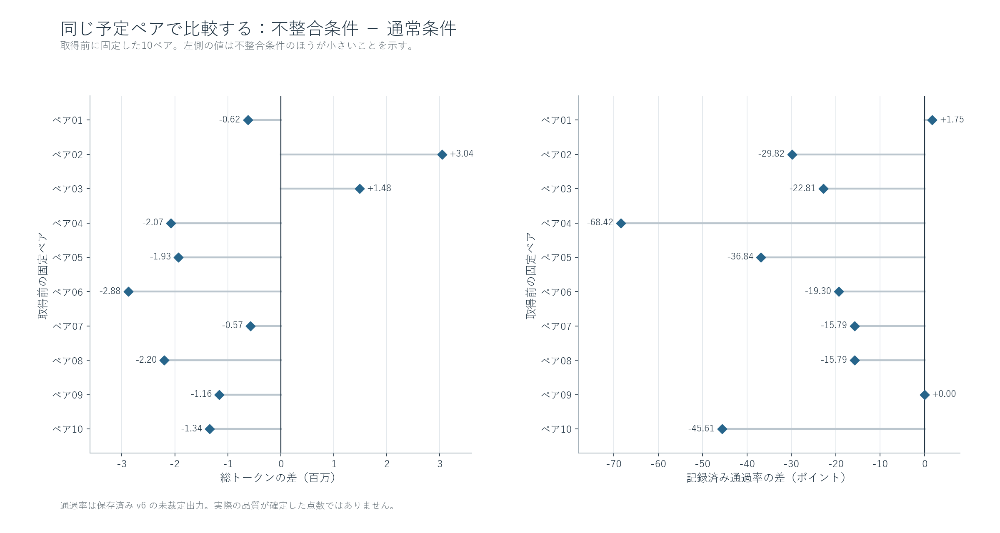
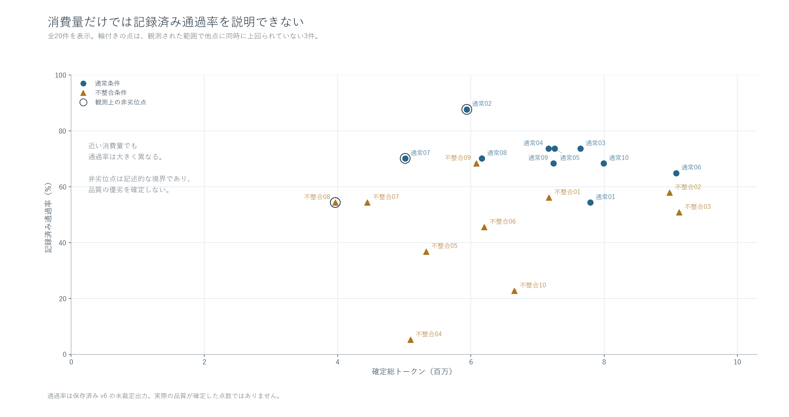
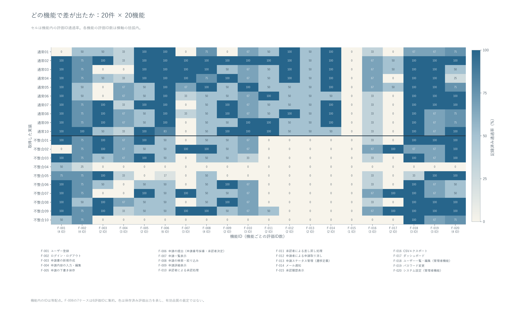
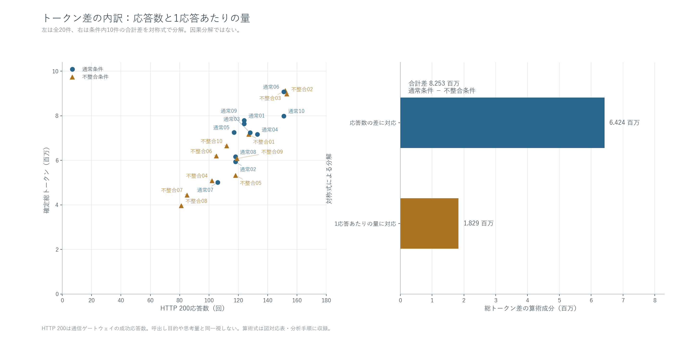
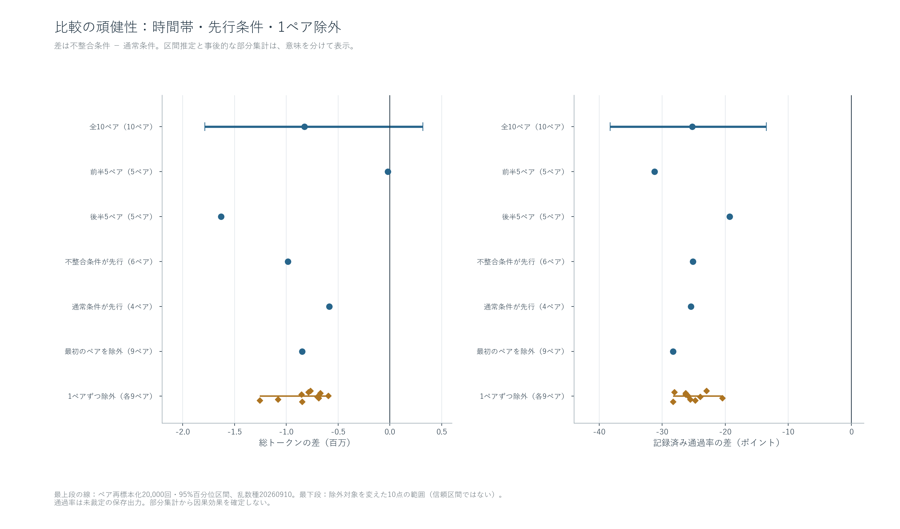

# 仕様内不整合の解釈と評価結果への波及

既存20 Runの再分析｜通常条件10件・不整合条件10件｜Muse Spark 1.2 Contributor

## このデータから何が言えるか

**最も強く支持される説明は、不整合条件の実装が矛盾を認識し、共通ルールより具体的な機能記述を優先した、というものです。** 全10件の判断記録に100万円と50万円の不一致が書かれ、全10件の固定コードが50万円で承認者を分岐しています。さらに7件では、保存済みの評価結果にも同じ閾値差のパターンが現れています。「矛盾に気づかなかった」という説明は、この記録に合いません。[根拠 C01](claims.md#c01)

**その選択は、閾値を直接確認する項目だけでなく、承認者を前提とする後続テストにも波及しています。** 静的に依存を確認した13 IDに、全合格数差の62.5%が集中します。保存traceには、部長へ割り当てられた申請を課長で差し戻そうとして403になる例、実際には部長へメールが届いているのに課長宛ての期待と合わない例があります。複数機能の失点を、同じ数の独立した機能欠如と読むことは適切ではありません。[根拠 C02](claims.md#c02)

**不整合条件のトークン減少は、評価項目への適合効率の改善を意味しません。** 平均総トークンは11.6%少なく、合格ID数の平均は35.8%少ないため、合格1 IDあたりの合計トークンは37.8%多くなります。ただし、低消費で同等以上の得点を得た不整合Runもあります。差の方向、ばらつき、例外を一緒に見る必要があります。[根拠 C03–C05](claims.md#c03)

本報告の「充足率」は、**保存済みv6が記録した合格ID数 / 57**です。アプリの総合品質や、修正済みの評価点とは区別します。旧評価の裁定はそのまま残し、観測機・実装アプリ・評価器を再実行せずに分析しました。

## 1. 「認識した後の選択」に一貫性がある

不整合条件の全10件は、判断記録で共通の100万円基準とF-006の50万円基準を対比し、F-006を選んでいます。主な理由は、提出処理の詳細に数値分岐が明記されており、概要より具体的な記述を優先するというものです。一部は、評価で期待される振る舞いも具体的な記述に沿うと推定しています。これは実際の非公開テストを知っていた証拠ではなく、保存された自己説明です。

| 証拠の層 | 通常条件 | 不整合条件 | そこから言えること |
| --- | --- | --- | --- |
| 判断記録 | 100万円を採用 | 10件とも不一致を明記し50万円を採用 | 提出物に記された解釈 |
| 固定backendの承認分岐 | 10件とも100万円 | 10件とも50万円 | 保存コード上の選択 |
| 閾値周辺の既存評価結果 | 直接3 IDは全件合格 | 7件で100万円未満の課長期待に不一致、100万円以上は一致 | 観測済み挙動との対応 |

不整合004・005は閾値ケースへの前提が成立せず、不整合010も同じ通過パターンにはなっていません。したがって、静的な選択は全10件で確認できても、同じ動作を全10件で確認できたとは扱いません。モデル応答についても、通常の文章発言、判断記録を書き込むツール要求、固定提出物を区別しています。[Run別の読解記録](evidence/qualitative.json)

**考察:** 矛盾の検出と、研究側が想定する優先順位への適合は別の能力です。この実験では、矛盾を記録する行動と、共通100万円基準から外れる実装が同時に成立しました。仕様を読む側へ単に「矛盾に気づくこと」を要求しても、優先順位が明示されなければ期待する分岐には揃わない可能性があります。一方、この自己説明からモデル内部の思考過程全体や他モデル一般の判断規則を断定することはできません。

## 2. 失点の広がりには、承認者を共有する評価経路がある

v6の保存コードを読むと、後続テストの共通準備に50万円の申請作成があり、その後に課長の承認・差し戻し・通知先などを期待する経路があります。通常条件では50万円は課長、不整合条件では部長です。この段階でテストの役割前提と実装が選んだ承認者が分かれます。

[拡大用SVG](figures/06-dependency-path.svg)

**保存証拠の具体例は、不整合009の差し戻しと承認依頼メールです。** T-011-01では、50万円の提出応答に部長の承認者が記録され、その後、課長としての差し戻し要求が権限不足の403で返りました。T-014-01では、部長宛ての承認依頼メールが実在しますが、評価側は課長宛てを探していました。この二つを「差し戻し機能が存在しない」「メールが生成されなかった」と説明すると、保存データと矛盾します。[証拠のUUID・hash・trace内参照](evidence/private-evidence-index.json)

この経路を基に、57 IDを次の3群へ分けました。これは**スコア差の所在を説明する事後分類**であり、配点の変更ではありません。

| 評価群 | 通常：合格 / 対象ID | 不整合：合格 / 対象ID | 合格数の差（通常−不整合） |
| --- | --- | --- | --- |
| 閾値を直接確認する3 ID | 30 / 30 | 0 / 30 | 30 |
| 閾値に依存する後続10 ID | 61 / 100 | 1 / 100 | 60 |
| 上記以外の44 ID | 311 / 440 | 257 / 440 | 54 |

[拡大用SVG](figures/05-gap-decomposition.svg)

直接3 IDと後続10 IDの差は合計90、全体差は144です。したがって62.5%がこの13 IDに集中します。後続群はT-010-01、T-011-01/02、T-012-01/02、T-013-01/02、T-014-01/02、T-015-01です。50万円を使っていても、役職選択ではなく他人・申請者の権限拒否を確認するT-009-02、T-010-03は含めません。[全57 IDの分類根拠](evidence/dependency-map.json)

**考察:** 広い機能範囲に差があること自体は、広い範囲の独立した実装損傷を意味しません。一つの仕様解釈が、共通する申請・役割の前提を通じて複数の評価項目へ現れる構造があります。ただし62.5%をAP-001の因果寄与率とは呼べません。準備失敗や別原因も群内にあり、閾値を直した後に何点回復するかは観測していません。また共通100万円基準による評価である以上、役割期待との不一致を自動的に評価器のバグとも扱いません。

## 3. 消費量は減ったが、合格項目あたりの消費は増えた

| 指標（各条件10 Run） | 通常条件 | 不整合条件 |
| --- | --- | --- |
| 確定総トークンの合計 | 71,287,304 | 63,034,683 |
| Run平均トークン | 7,128,730.4 | 6,303,468.3 |
| Run中央値トークン | 7,248,219 | 6,139,945 |
| 合格ID数の平均 / 57 | 40.2 | 25.8 |
| 評価項目充足率の平均 | 70.5% | 45.3% |
| 合格ID数の中央値 | 40 | 30 |
| 合格ID数の標準偏差 | 4.76 | 10.73 |
| 合計トークン ÷ 合計合格ID | 177,331.6 | 244,320.5 |

[拡大用SVG](figures/01-distributions.svg)

全件採用した確定総量は134,321,987トークンです。通常条件・不整合条件とも10件を分母にしています。平均トークン差は-825,262.1、充足率差は-25.3ポイントです。

本報告の適合効率は「条件内の合計トークン ÷ 条件内の合計合格ID」で計算します。通常条件は177,331.6、不整合条件は244,320.5トークン / 合格IDです。これは実際に通過と記録された項目あたりの投入量であり、独立した価値単位や金銭費用ではありません。特に同じ前提に依存するIDがあるため、業務価値へそのまま換算できません。

**考察:** 「少ないトークンで終わった」という事実だけを効率改善と評価すると、達成した項目数の減少を見落とします。今回の集計では、消費量の減少より充足項目の減少が大きいという関係です。一方、Runごとのトークン / 合格IDを単純平均すると通常181,094.4、不整合393,902.1となり、最小3 IDのRunの影響が強く出ます。本文では合計同士の比を主指標とし、Run別値もSQLiteに残します。[根拠 C03](claims.md#c03)

## 4. 差は最悪の1件だけでは説明できないが、例外もある

固定10ペアでは、不整合条件の合格ID数が少ないペアが8、同点が1、多いペアが1でした。トークンは不整合条件が少ないペアが8です。

[拡大用SVG](figures/02-pair-differences.svg)

合格ID数の標準偏差は4.76対10.73、分散比は約5.09倍です。不整合条件には低得点側への大きなばらつきがあります。しかし1ペアずつ除いた10通りすべてで、平均合格ID差は-16.11〜-11.67と負でした。最悪の不整合004を含むペアだけで全体差が作られた、という説明では不足します。

反対に、ペア001は不整合条件の方が1 ID多く、ペア009は同点でトークンが少なくなっています。不整合008は3.97百万トークンで31 IDに達し、観測された低消費側の有力な点です。トークンが少なく合格数が同等以上の別Runに支配されない観測点は、通常002・通常007・不整合008でした。これは今回の得点と消費量上の比較で、将来の実行性能を保証する順位ではありません。[根拠 C04](claims.md#c04)

## 5. トークンだけでは成果の違いを十分説明できない

[拡大用SVG](figures/03-token-score.svg)

| Run | 総トークン | 合格ID / 57 |
| --- | --- | --- |
| 通常条件002 | 5,938,760 | 50 |
| 通常条件008 | 6,165,950 | 40 |
| 不整合条件009 | 6,079,458 | 39 |
| 不整合条件006 | 6,200,432 | 26 |

約600万トークンの近接した投入量でも、合格IDは26〜50に分かれます。全20件のPearson相関は0.233ですが、条件内では通常-0.470、不整合0.218です。順位相関でも、通常-0.587、不整合0.182と同じ方向の傾向です。

**考察:** 条件を混ぜた散布図から「多く使うほど良い成果が出る」と一般化する根拠は弱いと考えます。難航した実装がトークンを増やすという逆向きの説明、実装方針や評価の到達経路が双方に影響する説明も残ります。多変量モデルへ多数の説明変数を投入するより、この20点と具体例を見せる方が、現状のデータに見合います。[根拠 C05](claims.md#c05)

## 6. 閾値依存を分けても差は残るが、失敗数は欠陥数ではない

[拡大用SVG](figures/04-feature-heatmap.svg)

閾値直接・後続依存13 IDを除く44 IDでも、通常70.7%、不整合58.4%で、12.3ポイントの差があります。この限定集計は「残る差の探索」であって、AP影響を取り除いた真の品質や、新しい正式スコアではありません。

| 分類 | 通常条件 | 不整合条件 | 差（通常−不整合） |
| --- | --- | --- | --- |
| 正常系 | 57.2% | 34.7% | 22.5ポイント |
| 境界値 | 100.0% | 23.3% | 76.7ポイント |
| 異常系 | 85.9% | 63.6% | 22.3ポイント |

境界値群の差は大きいものの、対象は3 IDで、閾値操作に近い項目を含みます。正常系と異常系にも差があるため、境界値だけの問題とする説明でも不足します。一方、全20件で合格ゼロなのはT-004-03, T-013-01, T-015-01, T-016-01です。これらは条件差を生まない共通の不成立項目であり、不整合条件固有の弱点として数えるべきではありません。

| 保存ケースの記録 | 通常条件 | 不整合条件 |
| --- | --- | --- |
| 要求ケース数 | 580 | 580 |
| 業務判定まで到達 | 486 | 352 |
| raw status が blocked | 52 | 127 |
| coverage の前提未成立 | 50 | 127 |

到達・前提未成立・判定未解決は重なる分類です。normalのraw blocked 52とcoverageの前提未成立50も同じ列ではありません。単純な積み上げや合算は行いません。

責任裁定が未確認なのは、非合格483ケース中477ケースです。今回の静的読解とtraceの具体例を加えても、残る全ケースの責任まで決めたことにはなりません。**考察:** 得点差を研究結果として提示しつつ、独立した実装不備の個数と読み替えないことが必要です。課題は「不整合条件のどの機能が壊れたか」だけでなく、「どの前提の違いが、どこまでの評価を連動させたか」にもあります。[根拠 C06](claims.md#c06)

## 7. トークン差の大部分は応答回数の差として分解できる

| 指標 | 通常条件 | 不整合条件 |
| --- | --- | --- |
| HTTP 200応答数 | 1270 | 1154 |
| HTTP 200応答あたりトークン | 56,131.7 | 54,622.8 |
| 平均経過秒 | 717.7 | 736.5 |
| 経過秒の中央値 | 663.3 | 713.9 |

[拡大用SVG](figures/07-process.svg)

不整合条件ではHTTP 200応答数が9.1%少なく、1応答あたりの平均トークンは2.7%少なくなっています。総量差8,252,621を対称な算術分解で分けると、応答回数の成分が6,423,762（77.8%）、応答あたり量の成分が1,828,859です。

ここで応答回数はgatewayのHTTP 200件数で、独立した思考ステップやツール操作回数と同一ではありません。分解は合計の恒等式であり、応答数を減らせば同じ成果が得られるという因果効果ではありません。

平均経過時間は不整合条件の方がわずかに長く、トークンの減少と時間短縮も一致していません。初回の管理停止待ちを含むため、所要時間には完了後の処理や待ち時間も入ります。**考察:** 今回のトークン差を「矛盾の検討に時間を使わなかった」「早く終了した」と説明することはできません。モデル応答数、1応答あたり量、実時間は別々に扱う必要があります。[根拠 C07](claims.md#c07)

## 8. 得点差とトークン差では、安定性が異なる

| 比較 | 対応ペア数 | トークン差（不整合−通常） | 充足率差 |
| --- | --- | --- | --- |
| 全10ペア | 10 | -825,262.1 | -25.3ポイント |
| 前半5ペア | 5 | -20,261.4 | -31.2ポイント |
| 後半5ペア | 5 | -1,630,262.8 | -19.3ポイント |
| 不整合条件が先行 | 6 | -985,667.0 | -25.1ポイント |
| 通常条件が先行 | 4 | -584,654.8 | -25.4ポイント |
| 最初のペアを除外 | 9 | -847,707.3 | -28.3ポイント |

[拡大用SVG](figures/08-sensitivity.svg)

前半5ペアのトークン差はほぼ同量で、後半5ペアでは不整合条件が大きく少なくなっています。一方、充足率差は前半・後半の両方で負です。先行条件を分けても合格ID差は近く、先行条件だけで全体の得点差が説明されるとは考えにくい結果です。

10ペアを再標本化した95%区間は、トークン平均差で-1,785,974〜319,092、充足率差で-38.2〜-13.5ポイントでした。トークン差の区間は0を跨ぎます。これは採用総量の確定性とは別で、Run間のばらつきを踏まえた条件平均差の不確実性です。

**考察:** この標本では得点差の方向は比較的持続していますが、平均トークン減少を時間的に安定した効果と解釈するには弱い面があります。前後分割は事後的な感度分析であり、時間帯の因果効果を特定したわけではありません。bootstrapも、この単一アプリ・10ペアの観測分布からの再標本化で、評価器の系統的な制約を補正するものではありません。[根拠 C08](claims.md#c08)

## 9. 全20件を使う変更は、比較対象の偏りを小さくした

| 条件 | HTTP 400 | Run数 | 平均トークン | 平均合格ID |
| --- | --- | --- | --- | --- |
| 通常条件 | なし | 5 | 6,455,265.2 | 42.2 |
| 通常条件 | あり | 5 | 7,802,195.6 | 38.2 |
| 不整合条件 | なし | 9 | 6,005,891.2 | 25.0 |
| 不整合条件 | あり | 1 | 8,981,662.0 | 33.0 |

旧レポートで総トークン確定値として選ばれたのは、通常5件と不整合9件でした。通常条件では、400を含む5件が平均高消費・低得点側にあり、その全件が旧トークン平均から外れていました。不整合条件で外れていたのは1件です。

新しい採用規則で全20件を使うと、平均トークン差は旧-449,374.0から、新-825,262.1へ変わります。**考察:** これは単なる欠測表示の変更ではなく、どのRunを比較に含むかという分析対象の変更です。今回のユーザー指定により、全件を一貫した定義で比較できるようになりました。400の発生自体は無作為に割り当てられていないため、400が高消費や低得点を引き起こしたとは言いません。[根拠 C09](claims.md#c09)

## 統合的な考察と研究上の示唆

**今回の結果は、仕様内不整合への応答を「気づいたか／気づかなかったか」だけで評価すると、重要な違いを取り逃がすことを示しています。** 保存された判断記録とコードでは、不整合条件の全10件が詳細記述を優先しています。観測された閾値のパターンと、後続の役割・通知先の不一致は、その選択と整合します。

**また、一つのルール選択に依存する複数のE2E項目は、得点を通じて同じ違いを繰り返し表す場合があります。** 今回の13 IDへの集中と具体的traceは、その経路を検討する根拠になります。研究結果を理解するには、57点の合計に加え、依存する評価群と各ケースの到達経路を示すことが有用です。これは既存の採点基準を否定したり、失点を帳消しにしたりする提案ではありません。

**消費量の比較も、達成度と実行間のばらつきを伴って初めて意味を持ちます。** 平均では不整合条件の消費が少なくても、項目あたり投入量は増え、条件内には低消費で同等以上の成果を出した例もあります。全体平均、ペア差、反例、依存関係を組み合わせた説明が、このデータに最もよく対応します。

次の研究で確かめる価値があるのは、①記述の優先順位を明示した場合に選択が変わるか、②承認者に依存する準備を明示した評価で後続項目をどう解釈できるか、③同じトークン差が別の時期・アプリでも現れるか、です。**これらは今回実行していません。** 本報告の範囲は、既存データから得られる説明と、次に区別すべき仮説の提示までです。

## データ・方法・追跡方法

- 固定20 Run、全件Muse Spark 1.2 Contributor。同時実装数1、各Run上限60分、固定seed 20260910の10ペア。初回antiを含め、除外・置換はしていません。
- 新分析UUID：51f9cd42-e031-447d-82e5-5318fcf4a76e。元SQLite SHA256：c5816c01c64f735e2cfb919df1d4fe8f1ce551d432c4201feff74fe9fe807d33。
- 元の5テーブルを新SQLiteにも保持し、新しいreport_テーブルだけで採用総量、項目集計、依存分類を追加しました。総トークンは全件の既知合計を確定総量とするユーザー指定です。旧usageフラグと400記録は変更していません。
- 平均・中央値・標準偏差はRun単位。四分位点は線形補間。割合の差はポイント、相対変化は通常条件を基準にします。効率の主指標は合計同士の比です。
- bootstrapは固定10ペアを復元抽出、20,000回、seed 20260910、percentile 95%区間。ケースやIDを再標本化していません。1ペア除外、前後半、先行条件、旧抽出との比較は探索的感度分析です。
- 未裁定raw結果も含む既存評価項目充足率を比較しました。旧invalid/pending裁定は保持し、今回の読解を採点値や責任裁定へ上書きしていません。
- 非公開評価コード・画面・traceは元の保管先に残しています。新フォルダにはhashと要約を収録し、機密情報やAPI鍵は参照していません。

[主張と証拠の対応表](claims.md)｜[SQL](queries.sql)｜[分析用SQLite](analysis.sqlite)｜[全Run集計](tables/runs.csv)｜[分析Notebook](analysis.ipynb)｜[再生成手順](reproduce.md)｜[入力とhash](source-manifest.json)｜[検証結果](validation.md)
