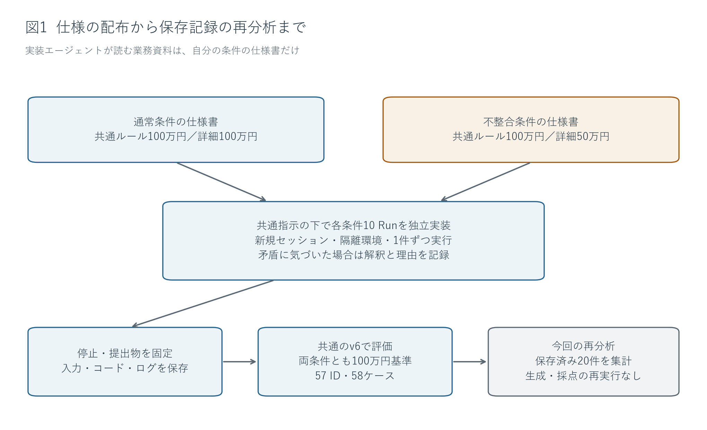
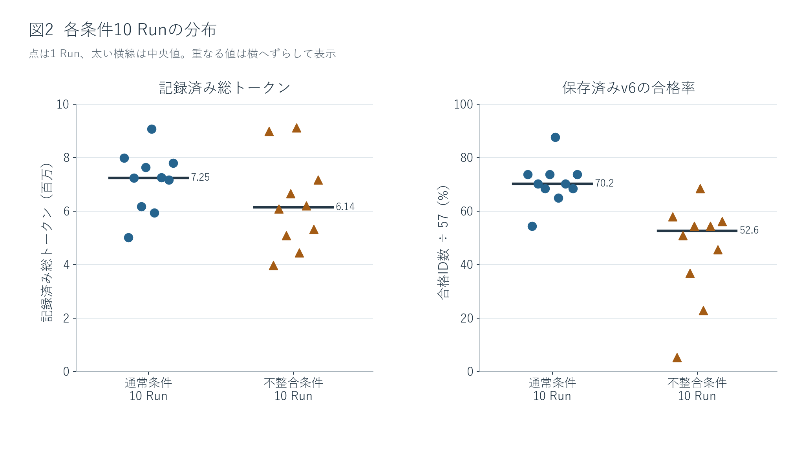
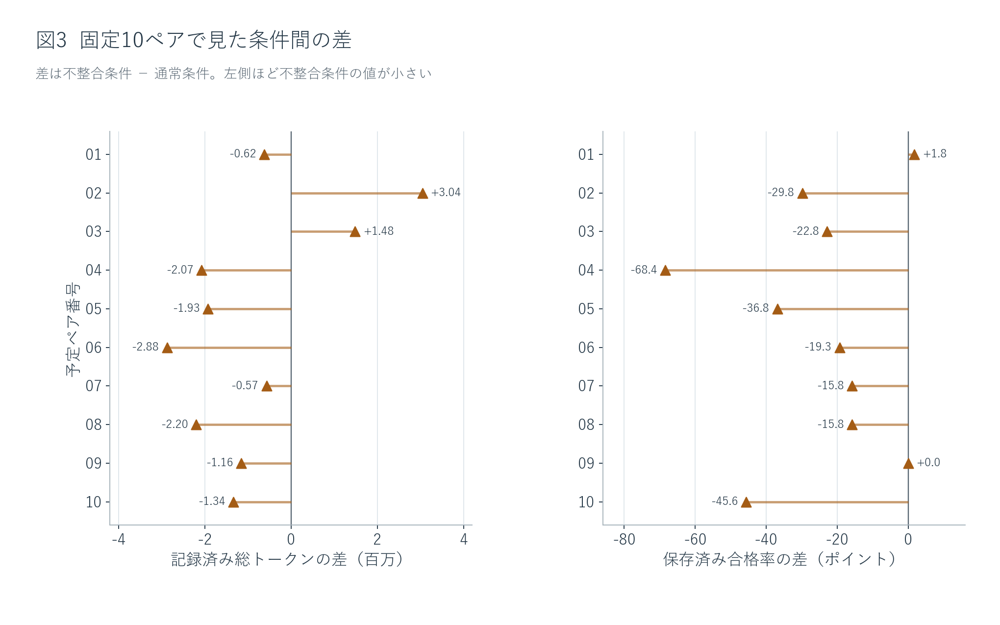
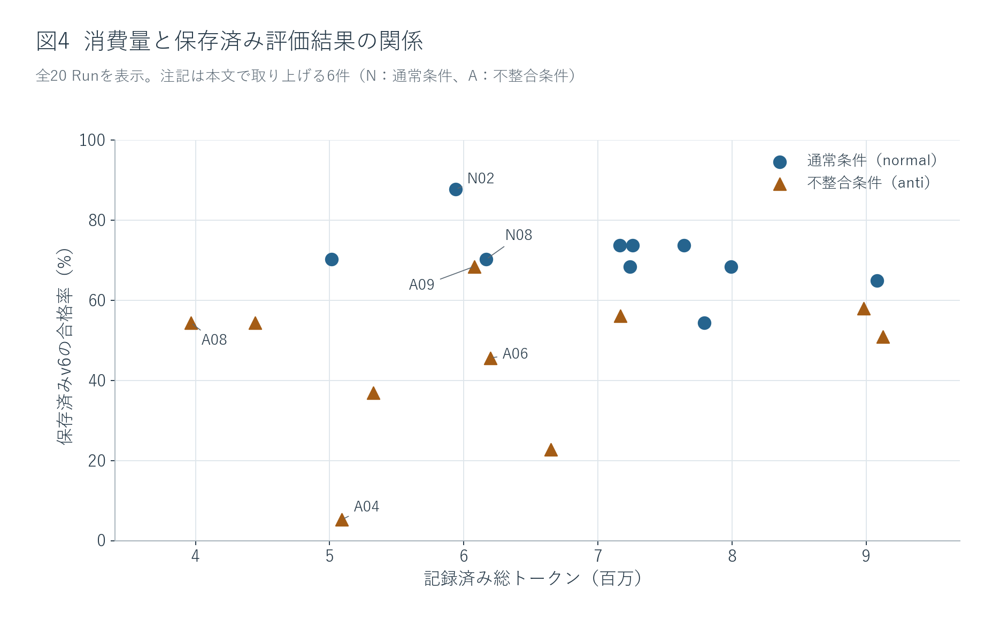
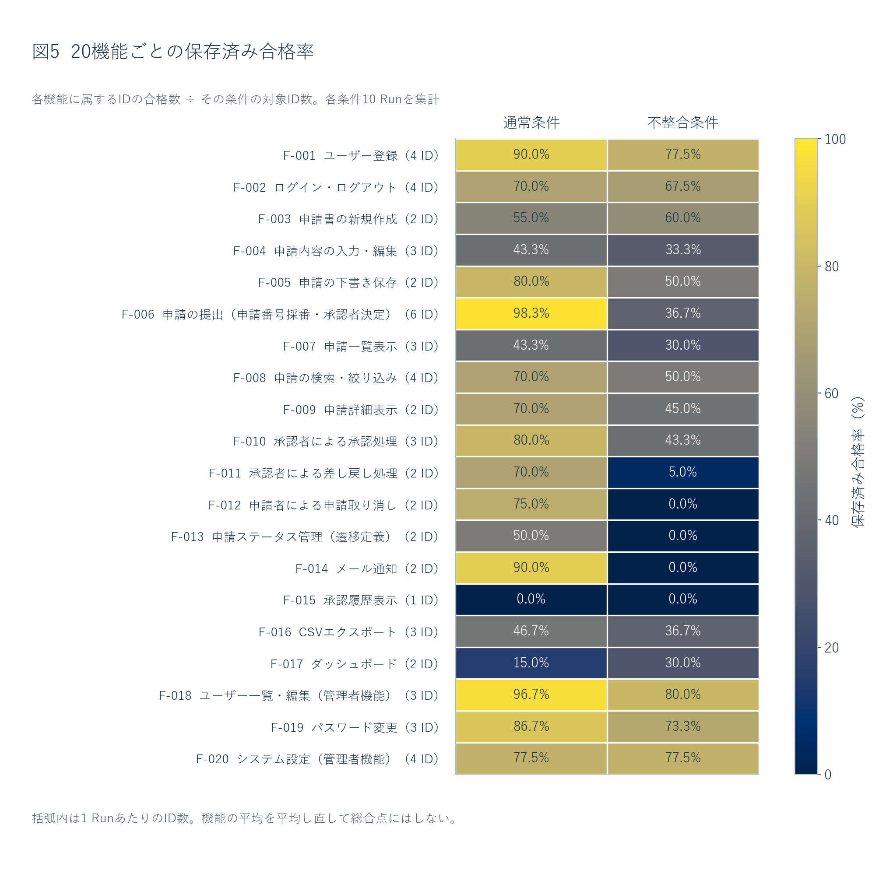
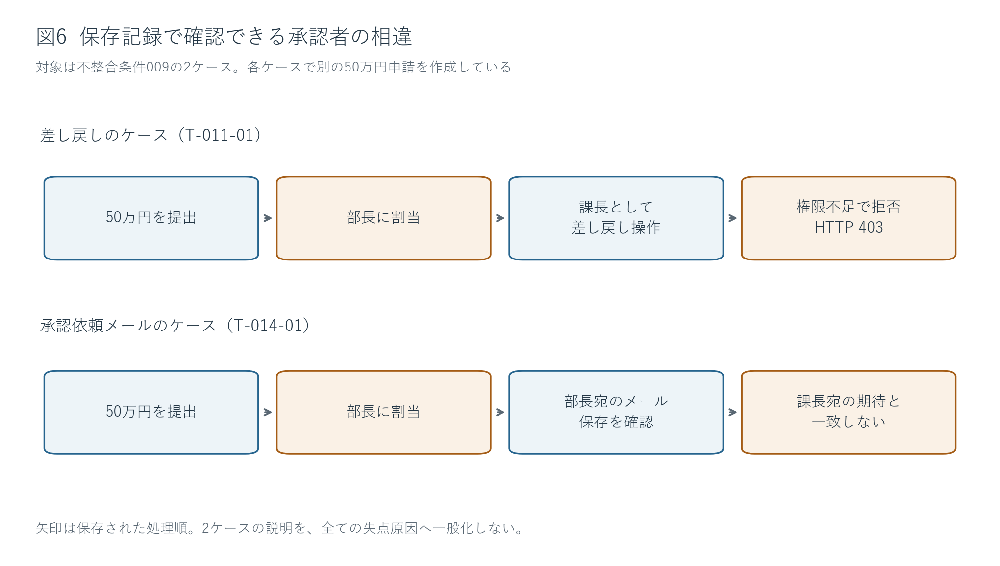

# 仕様書内の不整合とAI実装の消費トークン・評価結果

既存20 Runの再分析｜通常条件10 Run・不整合条件10 Run｜日本語レポート v2

## 1. 背景と研究目的

仕様書の複数箇所に異なる業務ルールが記載されている場合、実装者はどの記述を採用すべきか判断を迫られる。ソフトウェア開発をAI（大規模言語モデル）に委ねる場合であっても、矛盾する記述を同時に満たすことはできない。その際、実装に伴う消費トークン数や、完成したアプリケーションが本来の業務要件にどの程度適合するかには、どのような違いが生じるだろうか。本研究では、1つの申請管理アプリケーションの実装を題材として、この課題を検証した。

題材としたのは、ユーザー登録、申請の作成・提出、承認・差し戻し、通知、履歴、管理者設定など、20の機能を備えた業務アプリである。申請金額に応じて課長または部長を承認者として自動決定する仕様であり、本来の共通ルールは「100万円未満は課長、100万円以上は部長」と定められている。本実験では、仕様書内の提出処理の詳細規定における承認閾値のみを変更し、その他の業務要件は同一に保った。[資料1](sources.md#s1)

**表1　実装に渡した仕様と、共通評価が用いる基準**

| 比較する記述 | 通常条件（normal） | 不整合条件（anti） |
| --- | --- | --- |
| 仕様書冒頭の共通承認ルール | 100万円未満は課長、それ以上は部長 | 通常条件と同一 |
| 提出処理F-006の詳細 | 999,999円以下は課長、1,000,000円以上は部長 | 499,999円以下は課長、500,000円以上は部長 |
| 仕様書内の整合性 | 二つの記述が一致 | 50万円以上100万円未満で承認者が食い違う |
| 両条件に適用した評価基準 | 元の100万円基準 | 元の100万円基準 |

たとえば75万円の申請を行う場合、通常条件では冒頭と詳細のどちらの記述に従っても課長が承認者となる。一方、不整合条件では冒頭のルールでは課長、詳細規定では部長が指定され、記述間に矛盾が生じる。本研究ではこの仕様の不一致を「AP-001」と呼ぶ。「不整合条件」はこの特定の食い違いを含む実験条件の名称であり、あらかじめ劣った結果が出ることを前提としたラベリングではない。

研究における主要な比較軸は、**1回の実装あたりの総消費トークン数と、共通評価における合格率**である。判断ログの記録や生成コードの精査は、数値的な差異の背景を説明するために用いる。プロンプト内で矛盾に言及したこと自体を加点対象としたり、特定の振る舞いや態度を品質として評価したりはしていない。また、50万円基準を採用した実装が元の100万円基準の評価と合致しなかったことのみをもって、モデルの判断が非合理的であったと断定することも避けている。

本報告は、過去に取得された計20回（20 Run）の実装ログと保存された評価データを再分析したものである。研究の背景を知らない読者にも、何を比較し、何が観測され、その結果をどこまで解釈できるかが明瞭に伝わるよう、方法、結果、考察の順で報告する。

## 2. 実験方法と指標の意味

### 2.1 実装と評価の実施方法

本研究における「1 Run」とは、新規セッションかつ隔離された環境で実施された1回の独立した実装試行を指す。通常条件と不整合条件を10 Runずつ、計20 Run実行した。各Runの実装モデルに渡した業務資料は担当条件の仕様書のみであり、他方の条件の仕様書、研究管理資料、非公開の評価コードなどは一切渡していない。[資料2](sources.md#s2)

**表2　20 Runに共通する実行条件**

| 項目 | 実施内容 |
| --- | --- |
| 実装モデル | Muse Spark 1.2 Contributor（全20 Run共通） |
| 推論設定・上限 | effort未指定、1 Runあたりの経過時間上限60分 |
| 同時実装数 | 1件（サブエージェントは使用せず単一セッションで実行） |
| 開始状態 | 新規セッション・隔離環境（共通スケルトンコードの配布はなし） |
| 共通の実装環境 | React／TypeScript、ASP.NET Core、SQLite |
| 矛盾への対応指示 | 気づいた箇所、採用した解釈、理由を記録し、自律的に判断して実装を進める |
| 人間への確認 | 無人実行（質問や承認待ちによる中断は行わない） |
| 実装の固定 | 完了宣言または制限時間到達で停止し、提出成果物とログを保存 |
| 評価 | 固定された共通評価スイート（v6）を適用（自主テストの実施は加点しない） |

保存された評価データでは、共通評価スイート（v6）の自動評価器がブラウザを自動操作し、画面表示や送信ログに記録されたメール内容を、元の業務要件に基づく期待結果と照合している。

なお、共通指示は全20 Runで同一であった。したがって後述する矛盾の記録は、プロンプトによる明示的な指示の下で得られた行動である。指示がない状態での自発的な矛盾検出や、人間に質問可能な対話環境との比較は対象外としている。

図1に示すとおり、実装の成果物を固定した後に共通評価を実施し、その保存記録を今回再集計した。取得した20 Runのデータはすべて保持しており、スコアの低さや測定上のトラブルを理由とした除外や再取得は一切行っていない。初回の不整合条件（anti-001）についても、完了宣言後の手動停止や過去の評価記録をそのまま残して集計に含めている。また今回の再分析にあたり、新たな追加実装、動作確認、再採点は行っていない。

実行順序については、通常条件と不整合条件を1件ずつ含む10組のペアを事前に編成し、乱数シード（seed 20260910）によりペア内の実行順を固定した。なお、ここでのペアは実行順序を制御するためのブロック化（対照配置）であり、モデルのシード値や生成途中の状態を共有しているわけではない。また、分析の基本単位はRunであり、57個の評価項目（ID）や58テストケースを独立した実験試行数として扱うことはしない。

### 2.2 指標の定義と検証範囲

**消費トークン数（総消費トークン）**は、保存されたモデル利用ログにおける入力トークンと出力トークンの合算値である。各Runの実装作業中に消費されたトークンを集計対象とし、提出後の採点や研究管理に伴う作業は含めていない。集計には全20 Runの記録値をそのまま用いている。なお、通常条件の5 Runおよび不整合条件の1 Runにおいて計29回のHTTP 400エラー応答が発生しており、これらの応答にはusage情報（利用量記録）が含まれていなかったため、未記録分は合計値に含まれていない。本分析では、不明な消費量を0として補完したり、記録された数値を確定的な全実消費量と見なしたりはしない。

**評価合格率（共通v6）**は、「各Runで合格と判定された評価ID数 ÷ 57 × 100（%）」と定義される。57個の評価IDは等配点であり、1つのIDに含まれる要求ケースがすべて合格した場合に1点となる。T-006-05のみ閾値境界の両側を検証する2ケースを含むため、1 Runあたりのテストケース数は計58ケースとなる。このうち片方のみが合格しても、当該IDは合格とは判定されない。[資料3](sources.md#s3)

評価の実行ログ自体は20 Run分存在するものの、**客観的に妥当性が完全に確認された評価は0件**である。過去の判定ステータス（invalid 1件、pending 19件）はそのまま維持している。したがって以下で比較するのは、自動評価器が出力した合格率そのものの数値である。通常の操作で到達可能な画面を評価器が認識できなかったケースや、前提処理の失敗により後続の判定へ進めなかったケース（blocked）も含まれるため、この数値はアプリの真の総合品質を表すものではない。

平均値・中央値・標準偏差はRun単位で算出する。主要な比較には全20 Runのデータを用い、ペア間の差、前後半の比較、1ペアずつ除外した感度分析などは、平均値の差異が特定の試行に過度に依存していないかを検証する補助分析として位置付けている。また、機能別や依存関係別の分類も採点基準を変更するものではなく、観測された差の所在を明らかにするための事後的な分析である。

## 3. 結果：全体像から具体例へ

### 3.1 不整合条件では、消費トークンと合格率の平均がともに低かった

**表3　全20 Runを含む条件別の記述統計**

| 指標 | 通常条件：10 Run | 不整合条件：10 Run |
| --- | ---: | ---: |
| 総消費トークン数 | 71,287,304 | 63,034,683 |
| 1 Runあたりの平均消費トークン | 7,128,730.4 | 6,303,468.3 |
| 消費トークンの中央値 | 7,248,219 | 6,139,945 |
| 合格ID数の平均 | 40.2 / 57 | 25.8 / 57 |
| 合格率の平均 | 70.5% | 45.3% |
| 合格ID数の中央値 | 40 | 30 |
| 合格ID数の標準偏差 | 4.76 | 10.73 |

両条件を合わせた総消費トークン数は134,321,987であった。不整合条件は通常条件と比較して、1 Runあたりの消費トークンが平均825,262.1トークン少なく、相対比で11.6%の減少となった。一方で、合格ID数は平均14.4個少なく、合格率の差は25.3ポイントの低下となった。なお、この11.6%という数値はログに記録された消費トークン数に基づく算出値であり、エラー応答等による未記録分を含めた実際の実消費量の差を確定的に示すものではない。[資料4](sources.md#s4)

図2に示すように、通常条件の合格ID数は31〜50、不整合条件は3〜39の範囲に分布した。不整合条件は低スコア側へのばらつきが顕著であり、標準偏差も通常条件より大幅に大きい。一方で、消費トークンの分布には両条件で重なり合う領域が存在し、すべての不整合Runが通常Runを下回っているわけではない。ただし中央値で見ても、消費トークンと合格ID数の双方が不整合条件において低い水準にとどまった。

### 3.2 平均値の差と各Runにおける個別傾向

**表4　全20 Runの値を固定10ペアで示した一覧**

各行の番号はRun名の末尾（識別番号）に対応している（例：002行はnormal-002およびanti-002）。トークン列は各Runの総消費トークン数、合格列は合格と判定されたID数（満点57）を表す。

| ペア | normal消費トークン | normal合格数 / 57 | anti消費トークン | anti合格数 / 57 |
| --- | ---: | ---: | ---: | ---: |
| 001 | 7,791,933 | 31 | 7,168,678 | 32 |
| 002 | 5,938,760 | 50 | 8,981,662 | 33 |
| 003 | 7,642,137 | 42 | 9,125,827 | 29 |
| 004 | 7,165,382 | 42 | 5,091,795 | 3 |
| 005 | 7,257,799 | 42 | 5,326,742 | 21 |
| 006 | 9,080,470 | 37 | 6,200,432 | 26 |
| 007 | 5,014,337 | 40 | 4,443,911 | 31 |
| 008 | 6,165,950 | 40 | 3,965,456 | 31 |
| 009 | 7,238,639 | 39 | 6,079,458 | 39 |
| 010 | 7,991,897 | 39 | 6,650,722 | 13 |

事前に対応付けられた同一ペア内で比較すると、不整合条件の合格ID数が通常条件を下回ったのは8ペア、同数だったのは1ペア、上回ったのは1ペアであった。消費トークン数においても、不整合条件の方が少なかったペアが8ペアを占めた。個別の例を見ると、ペア001では不整合条件が通常条件を1 ID上回り、ペア009では通常条件と同数の39 IDを、より少ない消費トークンで達成していた。

図3から分かるとおり、ペア004において合格率の差が突出して大きい。ただし、各ペアを1組ずつ除外して再計算した10通りの感度分析（Leave-one-pair-out）においても、平均合格ID数の差（不整合条件 − 通常条件）は−16.11〜−11.67の範囲にとどまり、すべて負の値を示した。すなわち、合格ID数がわずか3 IDにとどまったanti-004の特異値だけが、全体の平均差を一方的に引き起こしたわけではない。

消費トークンの差には、実行順序による差異も観察された。前半5ペアにおける平均差は−20,261.4トークンとほぼ同水準であったのに対し、後半5ペアでは−1,630,262.8トークンと不整合条件における消費トークンの減少が顕著になった。一方、合格率の差は前半で−31.2ポイント、後半で−19.3ポイントと、いずれの期間においても不整合条件が一貫して低かった。なお、この前後半の分割は結果の傾向を把握するために事後的に区分した補助分析であり、時間帯そのものの因果的影響を示すものではない。[資料5](sources.md#s5)

### 3.3 同水準の消費トークンでも合格項目数は大きく乖離した

図4が示すように、消費トークン数が約600万トークン前後の近い水準にあっても、normal-002は50 ID、normal-008は40 ID、anti-009は39 ID、anti-006は26 IDと、合格実績には大きな開きがある。同等の計算リソースを費やしたRun同士であっても、評価結果には明確な乖離が見られる。実際、全20 Run中で消費トークンが最少であったanti-008（約397万トークン）が31 IDに合格しているのに対し、約509万トークンを費やしたanti-004はわずか3 IDの合格にとどまった。このように、消費トークンの多寡と合格項目数は単純な一対一の相関関係にはない。

補助的指標として「条件ごとの総消費トークン ÷ 総合格ID数」を算出すると、通常条件の177,331.6トークン／IDに対し、不整合条件は244,320.5トークン／IDとなり、不整合条件の方が37.8%大きかった（合格ID数の合計は通常402件に対し不整合258件）。この比率は消費されたトークン量と合格項目の比率を示す目安にすぎず、金銭的コストやビジネス上の成果価値を直接換算したものではなく、また個々の機能を完成させるために要する標準量を示すものでもない。

### 3.4 差が生じた機能領域と評価器の到達範囲

図5に示すように、機能別の合格率を比較すると、申請提出処理（通常98.3% vs 不整合36.7%）、差し戻し処理（通常70.0% vs 不整合5.0%）、メール通知（通常90.0% vs 不整合0.0%）など、承認者の決定が関与する複数の機能において顕著な差が確認された。その一方で、新規作成（通常55.0% vs 不整合60.0%）やダッシュボード表示（通常15.0% vs 不整合30.0%）のように不整合条件の方が高い合格率を示した機能や、システム設定（両条件とも77.5%）、承認履歴表示（両条件とも0.0%）のように両条件で差が見られない機能もあった。

このように、不整合条件における合格率の低下は全機能に一律に生じたものではない。なお、各機能に含まれるテストIDの配分数は均一ではないため、これら20機能の合格率の単純平均は正式な57 ID等配点の総合評価とは重み付けが異なる点に留意されたい。[資料6](sources.md#s6)

**表5　保存されたケースの結果と判定への到達範囲**

| 記録の種類 | 通常条件 | 不整合条件 |
| --- | ---: | ---: |
| 要求ケース数 | 580 | 580 |
| 合格と記録されたケース数 | 412 | 265 |
| failと記録されたケース数 | 116 | 188 |
| blockedと記録されたケース数 | 52 | 127 |
| errorと記録されたケース数 | 0 | 0 |
| 業務上の判定まで到達したケース数 | 486 | 352 |
| 別途分類された前提未成立のケース数 | 50 | 127 |

表5に示す「合格」「fail」「blocked」「error」の4区分は、全580テストケース（58ケース × 10 Run）の直接的な実行結果の内訳である。続く「業務上の判定まで到達したケース数」および「別途分類された前提未成立のケース数」はテスト実行経路の到達状況を別の観点から分類したものであり、上の4区分の内訳に加算されるものではない。通常条件におけるblockedの52ケースと前提未成立の50ケースが完全には一致しないように、画面探索の失敗がfailとして記録されるケースも存在するため、failのすべてが実装側の欠陥に起因すると断定することはできず、またblockedだけで前提未達の全容を網羅できるわけでもない。

業務ロジックの判定ステップまで到達できたケースは、通常条件の486/580ケースに対し、不整合条件では352/580ケースにとどまった。不合格となった計483ケースのうち、不合格の原因（実装の誤りか、評価器側の操作制約か）の責任分類が客観的に確定していないケースは477ケースに上る。これらの数値は合格率の差の背景を探るための観察対象であり、ケースの数だけ独立した実装のバグが存在したことを意味するものではない。[資料7](sources.md#s7)

### 3.5 記録された仕様解釈、実装コード、評価時の挙動の整合性

**表6　仕様解釈に関する証拠を層ごとに整理した結果**

| 証拠の層 | 通常条件 | 不整合条件 | 確認した範囲 |
| --- | --- | --- | --- |
| 提出された判断記録 | 10 Runとも100万円を採用 | 10 Runとも不一致に言及し、50万円を採用 | 保存された説明文ログ |
| バックエンドの承認分岐コード | 10 Runとも100万円 | 10 Runとも50万円 | 保存されたソースコードの分岐 |
| 閾値周辺の合否パターン | 直接3 IDは全10 Runで合格 | 7 Runで詳細側50万円の選択に整合する合否パターン | 選択した境界ケースの既存結果 |
| 通信・メールの具体的読解 | 本節の具体例には選定せず | anti-009の差し戻し・メールの2ケース | 保存された通信ログとメール内容 |

不整合条件におけるモデルの判断ログでは、冒頭の100万円ルールと提出処理詳細の50万円ルールを比較したうえで、「より具体的な業務仕様の記述を優先する」という理由付けが10 Runすべてに明記されていた。提出されたバックエンドの実装コードを精査しても、全10 Runで50万円以上の申請を部長へ割り当てる分岐が記述されている。これは静的な記録およびソースコードの確認に基づく事実であり、今回の分析で実際にアプリを起動して動的に検証したことを意味するわけではない。

保存された合否結果において同様のパターンが確認された7 Runでは、100万円未満について課長承認を期待するテストケースが不合格となり、100万円以上で部長承認を期待するケースは合格していた。残る3 Run（anti-004、anti-005、anti-010）はこのパターンに揃っておらず、前段階のテスト準備の失敗などが含まれる。静的コード上で50万円を選択していた10 Runと、評価結果の挙動パターンが明瞭に一致した7 Runとは区別して理解する必要がある。[資料8](sources.md#s8)

図6の差し戻しテストケースでは、50万円の申請がモデルの実装によって部長へ割り当てられた後、評価器が課長権限で差し戻し操作を試みたため、権限不足（HTTP 403）となってテストが失敗していた。またメール通知のテストケースでは、別途作成された50万円の申請に対して部長宛ての承認依頼メールが正しく生成・保存されていたものの、評価器側は課長宛てのメールを期待していたために不合格となっていた。したがって、この失敗は「メール送信機能が未実装だった」わけではなく、承認者判定の食い違いに起因していることがログから確認できる。なお、これら2つのケースは同一のRun（anti-009）内のテストであるが、対象となった申請データ自体はそれぞれ別個に作成されたものである。[資料9](sources.md#s9)

### 3.6 合格数の差は承認閾値に関連する項目へ集中した

保存された評価器の処理ログと要件台帳を精査し、57個の評価IDを「閾値を直接確認する3 ID」「承認者の前提に依存する後続10 ID」「それ以外のその他44 ID」の3群に分類した。後続群には承認、差し戻し、取り消し、状態遷移、通知、履歴などの対象項目が含まれる。これは観測された差の構造を説明するための事後的な分類であり、配点や合否判定そのものを変更するものではない。[資料10](sources.md#s10)

**表7　依存関係で分けた合格ID数の所在**

| 分類 | 通常の合格 / 対象ID | 不整合の合格 / 対象ID | 合格数の差：通常−不整合 |
| --- | ---: | ---: | ---: |
| 閾値を直接確認する3 ID | 30 / 30 | 0 / 30 | 30 |
| 承認者の前提に依存する後続10 ID | 61 / 100 | 1 / 100 | 60 |
| その他44 ID | 311 / 440 | 257 / 440 | 54 |
| 全57 ID | 402 / 570 | 258 / 570 | 144 |

直接確認群と後続群における合格数の差は合計90個に達し、両条件の全体差（144個）の62.5%を占めている。すなわち、合格数の差の大半は、承認閾値に直接または間接に関係する13 IDに集中していた。一方で、それらを除外した「その他44 ID」においても54個の差が存在し、合格率で70.7%対58.4%と12.3ポイントの開きが依然として残っている。なお、ここでの分母570は、57評価IDを10 Run分合算した延べ評価機会数であり、独立した試行数ではない。

## 4. 考察と限界

### 4.1 仕様不整合の記録と詳細記述の選択が両立した背景

本研究の分析から得られた中心的な知見は、**不整合条件におけるモデルが、仕様の矛盾を明確に記録したうえで、より具体的な詳細記述である50万円ルールを選択・採用した**という点である。その根拠として、表6に示したとおり全10 Runの判断ログと生成コードの双方が完全に一致している。さらに7 Runにおいては、その判断と整合する評価合否パターンが確認された。したがって、単に「矛盾を見落としたために誤った実装に至った」という素朴な仮説では、これらの記録を十分に説明できない。

モデルが詳細記述を優先した背景には、「抽象的なルールよりも、個別機能の具体的な処理手順を優先する」という開発上の合理的推論が働いたと考えられる。F-006は申請提出時の承認者決定を数値で具体的に規定しており、そこを実装の拠り所としたことは、保存された判断ログの理由付けとも合致する。しかしながら、本実験の評価スイートは本来の100万円基準で固定されているため、この選択は結果としてテスト不合格を招くこととなった。**「評価基準への不適合」という客観的なテスト結果と、「矛盾する2つの記述のうちどちらを優先すべきかという判断の妥当性」とは、明確に区別して評価する必要がある。**

ただし、詳細記述を優先した理由付けは、モデル自身が生成した出力テキストに基づく解釈である。モデル内部の推論過程を直接観測したわけではなく、生成コードと整合するように事後的な理由付けが構成された可能性も完全には排除できない。また、すべてのRunにおいて「矛盾の記録と自律的判断」をあらかじめ指示していたため、全10 Runで矛盾が記録されていた事実をもって、事前の指示がない場合における矛盾検出能力の高さや、人間への確認が不要である根拠と見なすことはできない。

実務的な観点からは、仕様書内に複数の解釈根拠が存在する場合、単に「矛盾を指摘せよ」と指示するだけでは、開発者が意図するルール通りの選択に収束するとは限らないことが示唆される。記述間の優先順位付けや、確認をエスカレーションする手順の明示化は、この観測結果から導かれる実務上の改善仮説である。ただし今回の実験ではそうした指示を追加した比較検証は行っていないため、それによってどの程度判断が揃うかは今後の検証課題である。

### 4.2 複数機能のスコア低下にみられる連鎖的影響

承認者の決定ロジックは、申請提出処理のみにとどまらず、その後の操作権限（誰が承認・差し戻しを行えるか）、通知メールの送信先、ステータス遷移など、後続の多くの機能に連鎖する。図6に示したように、部長へ割り当てられた申請を評価器が課長として差し戻そうとして権限エラー（403）となった事例や、部長宛てに送信されたメールが評価器の期待（課長宛て）と不一致になった事例から、単一の承認閾値の選択が複数の評価項目へと波及する具体的なメカニズムが確認できる。

したがって、表7の後続群で生じた60個の合格数差を「60個の独立した機能不具合」と解釈すると、同一の承認者不整合という単一の原因を多重にカウントしてしまうことになる。テストスコアは業務要件への適合度を総体として把握するうえで有用な指標であるが、得点の減少幅がそのまま不具合の種類や原因の数と一致するわけではない。今回の結果を正しく解釈するには、合計得点だけでなく、複数のテスト項目が共有している共通前提やデータ連動に目を向ける必要がある。

もっとも、62.5%という数値は分類対象とした13 IDにスコア差が集約していたという算術的な比率にすぎない。当該群のテスト結果には初期化失敗や他の要因による不合格も含まれており、通信ログやメール内容まで具体的に検証したのは代表的な2ケースにとどまる。そのため、「スコア差の62.5%が仕様不整合（AP-001）のみに起因する」あるいは「閾値の記述を統一すれば直ちに90点分の合格が回復する」といった因果関係を断定することはできない。

一方で、承認者の判定が評価器の期待と食い違っていたからといって、自動評価器側のバグであると断じることも適切ではない。両条件ともに本来の100万円基準を満たしているかを検証する実験設計である以上、そこから外れた実装を不合格と判定すること自体は共通の評価方針に合致している。評価の妥当性を検討するにあたっては、モデル実装と本来の業務要件との不一致と、自動評価器が通常の画面操作を行えずに停止した問題とを、それぞれ個別の証拠に基づいて切り分ける必要がある。

### 4.3 消費トークンの減少は、必ずしも開発効率の向上を意味しない

不整合条件では、1 Runあたりの平均消費トークンが通常条件に比べて11.6%少なかったものの、合格ID数は35.8%減少していた。その結果、合格1項目あたりの消費トークン数は逆に37.8%増加している。この結果を踏まえると、消費トークン数の減少のみを捉えて「同等の成果をより少ない計算リソースで達成した（開発効率が向上した）」と解釈することはできない。

他方で、通常条件の実装が常に効率的であったとも言い切れない。ペア001やペア009のように、不整合条件の方が少ない消費トークンで同等以上の合格ID数を獲得した実例も存在する。また図4に示したように、同等水準の消費トークンであっても得点には大きなばらつきが見られる。平均値の傾向を論じる際にも、試行ごとの分布の重なりや反例に留意することで、実験条件のラベルのみから結果が一律に決まるような短絡的な解釈を避けることができる。

両条件間で消費トークン数に差が生じた背景としては、仕様矛盾の解釈に伴う思考負荷、実装アーキテクチャの選択、自己テストの実施範囲、試行錯誤に伴う修正反復の回数など、複数の要因が考えられる。しかし今回のデータ集計では、各作業工程が消費量の差にどれだけ寄与したかを個別に切り分けて測定していない。合格率の低かったRunが未実装の機能を残したまま早期に作業を終了したのか、あるいは実装に難航して修正を繰り返した結果なのかといった機序は、総消費量と得点の一対のデータからだけでは判別できない。

さらに、実行順序による差異も見逃せない。前半5ペアでは消費トークンの平均差がほとんど見られなかったのに対し、後半5ペアにおいて大きな差が生じていた。また、10ペアを単位とするリサンプリング分析（ブートストラップ法）においても、平均消費トークン差の信頼区間は0を挟んでいる。この結果は、今回観測された平均差の傾向が、別の実行環境や異なるタイミングでも再現性をもって現れると主張するには証拠が十分でないことを示している。なお、エラー応答等による未記録分の影響もこの分析では補正されていない。詳細な統計値および補助分析については[補足分析](supplement.md)を参照されたい。

### 4.4 承認閾値以外の項目に残るスコア差の未解明要因

閾値の直接確認群および後続依存群を除外した44 IDにおいても、依然として12.3ポイントの合格率差が残存している。また、各ペアを1組ずつ除外した感度分析においても、合格ID数の差の符号は常に不整合条件側が低く維持された。これらの事実は、全体の合格率差が承認閾値に関係する項目や、単一の極端なRunのみに起因するわけではなく、より広範な要因が関与している可能性を示唆している。

ただし、この44 IDのみを抽出した集計値は「仕様不整合の影響を完全に排除した純粋な品質」を表すものではない。事後的に分類したグループに含まれない機能であっても、前段の共通処理や実装アプローチを通じた間接的な影響を受けている可能性がある。また、テスト実行の到達範囲を見ても通常条件が486ケースであるのに対し、不整合条件は352ケースにとどまっており、自動評価器側の画面探索や初期化の制約が合格率を押し下げた可能性も排除できない。未到達ケースを除外して分母を縮小すると分析の前提が根本から変わってしまうため、本稿では正式な分母（57 ID）を維持した。

したがって、残余のスコア差の背景には、実際の要件実装の不足、共通前提の違いによる連鎖的影響、自動評価器の操作制約との相性、さらには各試行のばらつきといった複数の要因が混在している。どれか単一の要因を結論付けるのではなく、保存されたテストケース、画面操作ログ、生成コードを突き合わせて個別に検証する必要がある。現時点において、責任未確定の477ケースの原因を実装側または評価側のいずれか一方に一括して帰属させる客観的な根拠は存在しない。

### 4.5 本知見の適用範囲と今後の検証課題

本研究の検証対象は、単一の業務アプリケーション、1種類の承認閾値の不整合、特定のモデル構成（Muse Spark 1.2 Contributor）、および各条件10 Runの範囲に限定されている。したがって、この結果を仕様書に見られるあらゆる矛盾、他種の言語モデル、あるいは人間と対話しながら段階的に開発を進める運用形態へとそのまま一般化することはできない。また評価合格率についても、ユーザーが通常の操作を行うにあたって全要件が達成されていることを保証する品質指標ではない。こうした限界は、今回観測された数値差や記録の整合性を否定するものではなく、知見を適用できる妥当な境界を明確にするものである。

今後さらに切り分けて検証すべき論点としては、(1) 仕様記述の優先順位付けを変更した場合のモデルの選択行動、(2) 承認者の前提に依存する後続機能の成立度合い、(3) 別の大規模な試行群においても同様のトークン消費傾向が再現するか、という3点が挙げられる。これらは本実験の分析結果から導出された仮説であり、今回の作業で検証した範囲ではない。本研究の意義は、追加の実験を行うことなく、既存の20 Runの実装ログから、観測された客観的差異とその有力な説明候補を論理的に整理・明確化した点にある。

## 5. 結論

本研究において既存の20 Runを再分析した結果、不整合条件における1 Runあたりの平均消費トークン数は約630万トークンであり、通常条件の約713万トークンと比較して11.6%少なかった。同時に、共通評価（v6）の平均合格率も45.3%にとどまり、通常条件の70.5%を25.3ポイント下回った。消費トークンの減少のみをもって、開発成果の水準を維持したまま効率化が達成されたと結論付けることはできない。

モデルの判断ログおよび生成コードを精査したところ、不整合条件の全10 Runにおいて「詳細仕様の具体的な記述を優先する」として50万円基準が首尾一貫して選択されていた。さらに、7 Runで確認された閾値周辺の合否パターンや、具体的なテストケースにおける承認者・メール送信先の相違もこの判断と明確に整合している。このように、根本となる単一のルール選択が後続の複数機能の判定に連鎖的に波及することを考慮すると、合格項目数の差をそのまま独立した不具合の多さや、モデルの汎用的な実装能力の低下と同一視することは妥当ではない。

総括として、本実験の環境下においては、**「仕様の不整合を認識・記録して自律的に実装を進める能力」「元の共通業務要件への適合度」、そして「実装に要した消費トークン数」は、それぞれ独立した観点として切り分けて評価されるべきである**といえる。本報告では、確かな事実記録と未確定の要因を厳密に区別したうえで、仕様不整合がAIによるソフトウェア実装に与える影響の実態を明らかにした。
