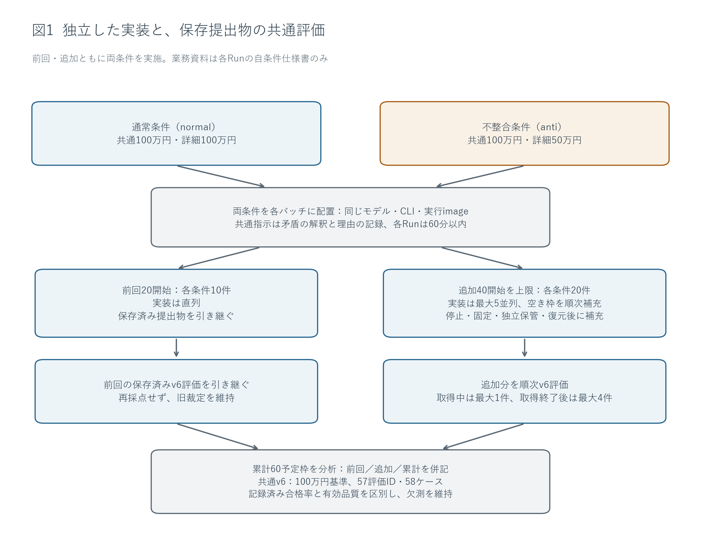
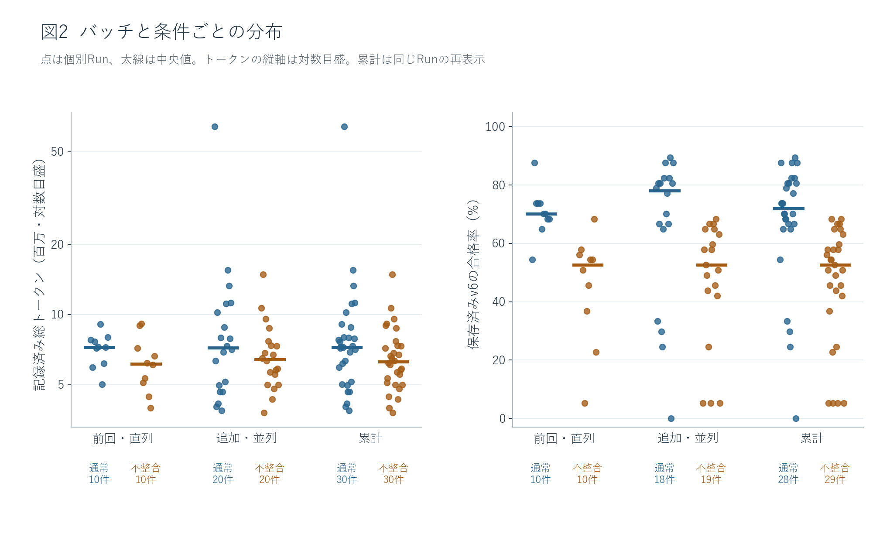
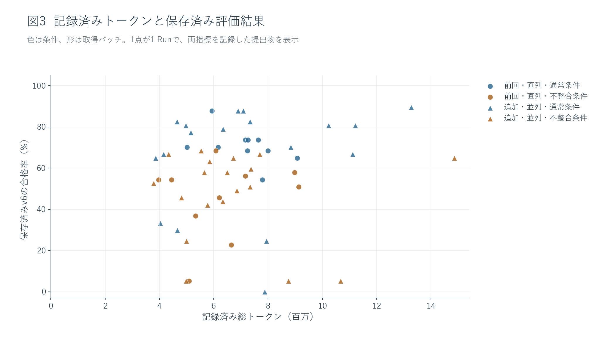
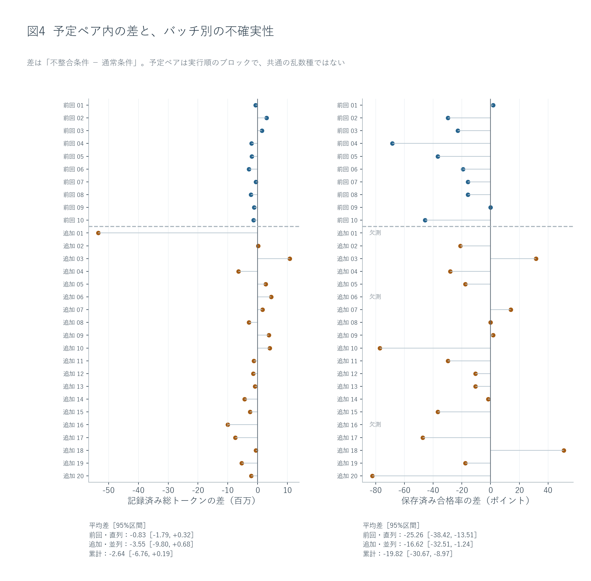
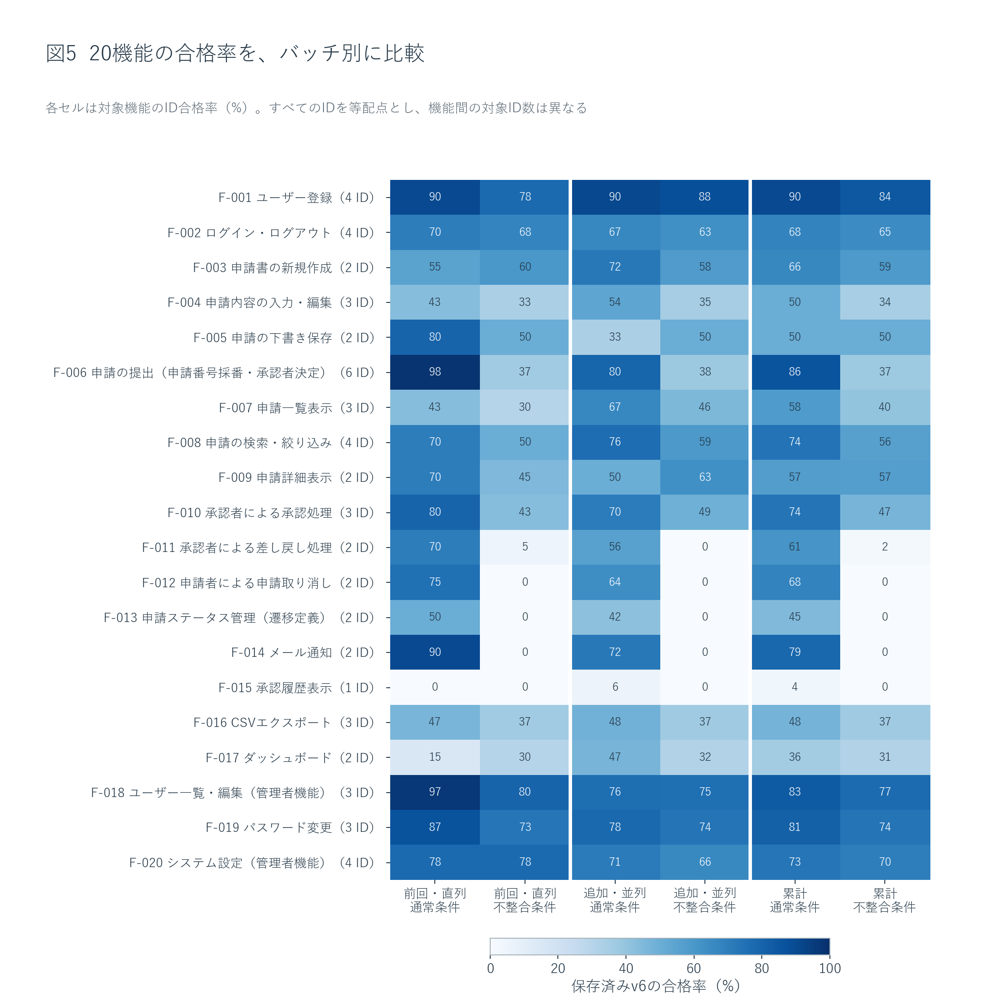
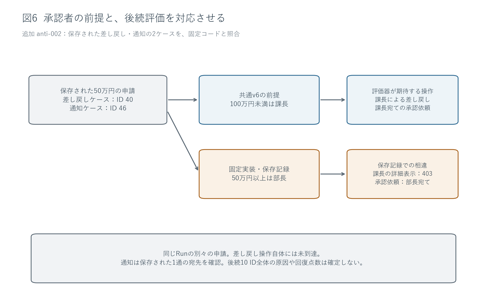

# 仕様書の不整合とAI実装：累計60件の取得と保存済みv6評価

前回20件に40件を追加し、通常・不整合の各条件30件、累計60件を分析した。追加分でも、不整合条件の全20件が詳細に記された50万円基準を採用した。累計の保存済みv6合格率は通常67.5%、不整合46.5%で、差の67.7%が追加取得前に分類を固定した13評価IDに位置した。一方、合格率の分布には重なりがあり、消費トークンが多いほど達成項目が多いという関係は再現しなかった。

記録済み総トークンは累計482,034,106。通常条件の平均が高かったが、大きな外れ値の影響を受け、ペア差の95%区間は0を含んだ。全60件のトークンを残し、起動不能3件の合格率は欠測としたため、合格率の観測対象は57件である。本報告は保存された評価出力の比較であり、製品品質の確定や、不整合の純粋な因果効果の推定ではない。

## 1. 背景と研究目的

業務仕様書の中に異なるルールが書かれていると、実装者はどちらを採用するか決めなければならない。本研究では、AIに申請管理アプリを実装させ、仕様書内の一つの不整合が、記録された消費トークンと、元の業務要件に基づく共通評価へどのように現れるかを調べた。題材は、ユーザー登録、申請の作成・提出、承認・差し戻し、メール通知、履歴、管理者設定など20機能を持つアプリである。

通常条件（normal）の仕様書では、冒頭の共通ルールと提出処理F-006の詳細が、ともに「100万円未満は課長、100万円以上は部長」を指定する。不整合条件（anti）では、冒頭の記述を保ち、詳細だけを「499,999円以下は課長、500,000円以上は部長」に変えた。この操作をAP-001と呼ぶ。たとえば75万円の申請では、通常条件はどちらの記述からも課長が選ばれる。不整合条件は、共通ルールなら課長、詳細なら部長となる。両条件の提出物を評価するv6は、元の100万円基準で固定した。

前回は各条件10件を直列に取得した。今回の目的は各条件20件を追加し、累計各30件の記録から、前回の解釈が追加データでも成り立つかを調べることである。問いは三つある。詳細規定の採用は再び観測されるか。条件間の合格数差は、承認閾値を直接確認する項目と、その前提に依存する項目へ集中するか。記録されたトークンが多いRunほど、合格項目数も多いといえるか。全体の傾向に加え、これらの説明に合わないRunを検討する。

| 条件 | 共通の承認ルール | F-006の提出処理 | 75万円の申請で生じる違い |
| --- | --- | --- | --- |
| 通常（normal） | 100万円未満は課長、以上は部長 | 同じ100万円基準 | どちらの記述でも課長 |
| 不整合（anti） | 100万円未満は課長、以上は部長 | 50万円未満は課長、以上は部長 | 共通ルールなら課長、詳細なら部長 |

操作したのは不整合条件の詳細規定である。評価側は両条件に対して100万円基準を使い、AP-001を通常の実装バグとして修正したり、実装役へ正答を誘導する追加説明を渡したりしなかった。

## 2. 実験方法と指標

1 Runは、空の独立環境で新規セッションを開始する1回の実装試行である。各Runに渡した業務資料は自条件の仕様書のみで、これに共通の実行契約を加えた。他条件、管理資料、非公開評価コードは渡していない。Muse Spark 1.2 Contributor、Copilot CLI 1.0.83-5、実行image、effort未指定、各Run上限60分、実装内の子エージェントなしという条件を前回から維持した。共通指示は、矛盾に気づいた箇所、採用する解釈、理由を記録し、人間への確認待ちで止まらず進めるよう求める。したがって、矛盾の記録はこの明示的な指示の下で得られた行動である。

追加分は、乱数seed 20260911で20組の予定ペアを開始前に固定し、各ペアに通常・不整合を1件ずつ配置した。前回の10ペアはseed 20260910で固定されたものである。ペアは実行順を近づけるためのブロックであり、生成乱数や途中状態を共有する双子の実装ではない。今回の最大5並列では、開始予約、停止未確認、保存・復元待ちも枠を占有する。1件の停止・提出固定・独立保管・復元が確認できた時点で次を始め、最初の5件全件の終了を待つ方式にはしなかった。

評価は固定した提出物の作業コピーに対して実施し、取得中は最大1件、全実装の終了後は最大4件とした。実装と評価はそれぞれ独立したDB、メール保存先、network、作業コピーを使う。Run UUID・提出hash・評価UUID・v6のhashで対応させ、完了順や同名の番号だけでは結合しない。評価結果を実装役へ返さず、低得点による取り直しも行わない。前回の20提出物と20評価結果は引き継ぎ、再実装・再採点していない。

指標の一つは「記録済み総トークン」である。保存済みDBのobserved_tokensを各Runの値として採用し、usageのない応答の未記録分は推定しない。元の総量や完全性フラグは別の列へそのまま残す。これは入力・出力として記録されたトークンの量であり、料金、実際のCPU時間、モデル内部の思考量を直接表す指標ではない。研究管理、採点、今回のレポート執筆の消費量も含まない。

元のusage_completeがfalseのRunは累計18/60件で、通常12/30件、不整合6/30件だった。この完全性の違いを残したまま、全60件の記録済み合計を採用する。完全性フラグをtrueへ変更したり、不明な消費量を0と認定したりはしていない（SQL C02）。

もう一つは「保存済みv6の合格率」で、合格した評価ID数を57で割る。57 IDは等配点である。T-006-05だけが境界の両側を確認する2ケースを持ち、両方が合格して初めて1 IDの合格となるため、1 Runのケース数は58となる。20機能、60予定枠、57評価ID、58ケースは異なる数え方である。合格率は自動評価の出力であり、製品品質の確定値ではない。前提操作が成立せず後続判定に届かない場合も、通常の評価実行が完了したRunでは分母57を保つ。Run全体が起動不能などで評価できない場合は、元の0合格やblockedの雛形を保存し、分析用の合格率は欠測にする。

前回に用いた直接3 ID・後続10 ID・その他44 IDの分類と主要論点は、追加分の結果を見る前に固定した。前回に対しては事後分類であり、追加分に対しては事前固定された確認軸となる。この分類で配点を変えたり、閾値を直せば何点回復すると見積もったりはしない。

数値は前回・追加分のSQLiteを読み取り専用で開き、UUIDと提出hash、評価hashを照合して算出する。条件別の記述統計と全Run一覧を残し、主たる条件比較は1.2同士で行う。不確実性は各取得バッチ内の予定ペアを復元抽出するbootstrapで示す。20,000回、seed 20260911の95%区間を使い、57 IDを独立標本数にしない。指標ごとの欠測に応じて完全なペアだけを用いるため、合格率差とトークン差の対象数は異なりうる。条件別平均も、完全ペアだけの平均差と常に一致するわけではない。

図1の両条件は、それぞれ前回と追加の両バッチに含まれる。追加分を評価しながら新しい実装を進めたが、その評価結果を後続の実装へ配布する経路は設けていない。事前固定した論点・分類・bootstrapの定義は[分析方針](analysis-policy.json)、評価不能の扱いは[指標の補足](measurement-notes.md)に保存した。

起動不能も試行の結果として記録し、合格率の欠測が無作為に生じたとは仮定しない。平均合格率は評価出力を利用できたRunに条件付けた値であり、全開始Runの品質平均とはみなせない。欠測の理由と件数を条件別に示し、観測できたRunの平均から欠測Runの品質を推定しない。

## 3. 結果

### 3.1 取得件数と、評価できた範囲

追加分は予定40件をすべて開始し、normal・anti各20件の原本を固定・独立保管・復元した。全件Muse Spark 1.2 Contributorで、代替モデル、枠外の有料smoke、取り直しはなかった。取得開始から最後の保管・復元まで144.78分、Runの最大実行時間は55.67分だった。6件目は、最初の5件すべての保管・復元が終わる45.60分前に開始しており、全件終了を待つセット方式ではなく順次補充が実行された。

| 対象 | 条件 | 予定／開始 | 固定・回収 | 評価出力 | 合格率を観測 | 全体評価不能 | 未開始 |
| --- | --- | --- | --- | --- | --- | --- | --- |
| 前回・直列 | 通常 | 10／10 | 10 | 10 | 10 | 0 | 0 |
| 前回・直列 | 不整合 | 10／10 | 10 | 10 | 10 | 0 | 0 |
| 追加・並列 | 通常 | 20／20 | 20 | 20 | 18 | 2 | 0 |
| 追加・並列 | 不整合 | 20／20 | 20 | 20 | 19 | 1 | 0 |
| 累計 | 通常 | 30／30 | 30 | 30 | 28 | 2 | 0 |
| 累計 | 不整合 | 30／30 | 30 | 30 | 29 | 1 | 0 |

取得失敗や時間切れによる終了はなく、未開始は0件だった。追加40件の評価出力はすべて保存したが、通常2件・不整合1件は標準起動が成立せず、業務ケースを開始できなかった。評価出力の保管完了までの経過時間は247.62分だった。取得中の評価は最大1件、取得後は最大4件で、実装5件と評価が併走した記録もある。資源不足による評価投入の一時停止はなかった。

追加分は2,280 Run×ID・2,320ケース、累計は3,420 Run×ID・3,480ケースの記録が揃った。この中には起動不能3件の174ケースの雛形が含まれる。合格率に値がある57 RunのID記録は3,249件であり、保存行数を業務判定の実行回数へ読み替えない。旧裁定のinvalid 1件・pending 19件と、新40件のpendingを維持し、有効品質を確定していない。

| バッチ・条件 | 業務判定到達の記録 | 前提操作で未到達の記録 | 評価未確定の記録 | 到達情報なし |
| --- | ---: | ---: | ---: | ---: |
| 前回・通常 | 486 | 50 | 96 | 0 |
| 前回・不整合 | 352 | 127 | 178 | 0 |
| 追加・通常 | 806 | 138 | 240 | 116 |
| 追加・不整合 | 688 | 248 | 258 | 58 |

これらは保存された到達タグの集計で、到達と評価未確定などは重なる場合がある。列を合計して58ケースへ戻す表ではない。起動不能だけでなく、通常の評価実行が完了したRunにも、入口や前提操作で止まった項目がある（SQL C05）。

追加normal-001は、保存された標準起動ログで、lockfileが指定したVite 5.4.2を固定オフラインキャッシュから取得できず、業務ケースへ進めなかった。原出力の0合格・57 blocked ID・58件の雛形は保存したが、分析用合格率は欠測とした。その記録済み総トークン64,175,188は消費量の集計に残す。具体的な保存先・hashは[証拠の読解記録](reviews/evaluation-observations.json)のOBS-new-normal-001-startupに示す。

追加anti-006も標準起動で停止したが、経路は異なる。ローカルに手書きしたVite代替の起動ファイルをbin/配下に置いたことが、保存されたtool呼び出しから分かる。共通契約は手書きソースをbin/へ置かないよう明示し、そのディレクトリは提出対象から除外される。固定提出物には起動ファイルがなく、保存起動ログは「vite: not found」だった。これは作業環境と提出契約の不一致であり、保管コピーの破損とは区別する。除外ファイルを戻す操作や再採点はしていない。

追加normal-016では、npmが@types/reactのメタデータをオフラインで取得できず、標準起動で停止した。固定lockfileのpackagesにはルート項目のみがあり、node_modules以下の解決済み項目がなかった。完了文書にはインストールと起動の成功が記されていたが、この自己申告と、固定提出物の評価環境での再現結果は分けて扱う。記録済み総トークン15,518,424を集計に残し、合格率は欠測とした。

### 3.2 条件別の分布と、予定ペア内の差

| 対象 | 条件 | 総トークン | 平均トークン | 中央値トークン | 平均合格ID | 中央値ID | 平均合格率 |
| --- | --- | --- | --- | --- | --- | --- | --- |
| 前回・直列 | 通常 | 71,287,304 | 7,128,730 | 7,248,219 | 40.20 | 40.0 | 70.5% |
| 前回・直列 | 不整合 | 63,034,683 | 6,303,468 | 6,139,945 | 25.80 | 30.0 | 45.3% |
| 追加・並列 | 通常 | 209,337,241 | 10,466,862 | 7,211,276 | 37.50 | 44.5 | 65.8% |
| 追加・並列 | 不整合 | 138,374,878 | 6,918,744 | 6,415,601 | 26.84 | 30.0 | 47.1% |
| 累計 | 通常 | 280,624,545 | 9,354,152 | 7,248,219 | 38.46 | 41.0 | 67.5% |
| 累計 | 不整合 | 201,409,561 | 6,713,652 | 6,265,904 | 26.48 | 30.0 | 46.5% |

通常−不整合の平均合格率差は、前回25.3ポイント、追加分18.7ポイント、累計21.0ポイントだった。追加分でも差の向きは同じだったが、前回と同じ大きさではない。百分率と差は丸める前の値から計算した。すべて1.2のRunなので、今回の全体集計と主モデル集計は一致し、代替モデルの集計対象は0件である（SQL C01・C13）。

追加分の通常条件は平均37.50 ID、中央値44.5 IDで、前回の平均40.20 ID・中央値40.0 IDと異なる形だった。平均は下がった一方、中央値は上がり、範囲は前回31〜50 IDから追加0〜51 IDへ広がった。標準偏差も4.76から14.79 IDへ増えた。したがって、通常条件が一様に低下したという要約はデータに合わない。不整合条件の中央値は前回・追加とも30 IDで、追加の範囲は3〜39 IDだった。

通常条件のトークン中央値は前回7,248,219、追加7,211,276と近いが、平均は7,128,730から10,466,862へ増えた。追加normal-001の64,175,188という大きな値が、平均と中央値の離れに関係する。図2のトークン軸は対数目盛で、同じ間隔が同じ倍率を表す。

図3は両指標がある57件を示す。起動不能3件には0%の点を置かず、そのトークンは図2と全Run表に残す。累計のSpearman順位相関は全体0.15、通常0.06、不整合0.07で、単純な右上がりの関係は弱い。追加normal-011は6,895,579トークンで50 ID、normal-008は7,937,543トークンで14 IDだった。一方、normal-017は13,272,983トークンで51 IDであり、多消費Runが必ず低いわけでもない。相関と反例は量と達成項目の対応を記述するもので、消費量を増減した実験ではない。

| 対象 | 指標 | 完全ペア数 | 平均差（不整合−通常） | 95% bootstrap区間 |
| --- | --- | --- | --- | --- |
| 前回・直列 | トークン（百万） | 10 | -0.8 | -1.8 〜 0.3 |
| 前回・直列 | 合格率（ポイント） | 10 | -25.3 | -38.4 〜 -13.5 |
| 追加・並列 | トークン（百万） | 20 | -3.5 | -9.8 〜 0.7 |
| 追加・並列 | 合格率（ポイント） | 17 | -16.6 | -32.5 〜 -1.2 |
| 累計 | トークン（百万） | 30 | -2.6 | -6.8 〜 0.2 |
| 累計 | 合格率（ポイント） | 27 | -19.8 | -30.7 〜 -9.0 |

累計の合格率差は、完全な27ペアで不整合−通常が平均−19.8ポイント、95%区間は−30.7〜−9.0ポイントだった。通常が高いペアは20、不整合が高いペアは5、同点は2である。追加分だけでは17ペア中12・4・1となり、平均差−16.6ポイントの区間は−32.5〜−1.2ポイントと広い。追加ペア03では通常19 IDに対して不整合37 IDで、平均の傾向に反する実例がある。

トークン差は累計30ペアで平均−2.64百万、区間は−6.76〜+0.19百万で0を含む。平均値は不整合条件で28.2%少ないが、この差を安定した節約効果と断定する根拠にはならない。1ペアずつ除く感度分析では、累計合格率差は−22.54〜−17.41ポイントで向きを保ち、トークン差は−3.11〜−0.89百万まで動いた。取得順の前半・後半や先行条件によっても差の大きさが変わり、追加分の先行条件別合格率差は通常先行−7.37、不整合先行−29.82ポイントだった。後者は少数の予定ペアの層別で、実行順の因果効果を示すものではない。

条件別の平均は値がある全Run、ペア差は両条件の値がある予定ペアを使う。欠測によって対象集合が異なると、二つの差は一致しない。全60件の一覧、標準偏差、全予定ペア、先行条件・前後半・1ペアずつの除外の結果は[補足集計](supplement.md)に示す。

### 3.3 判断記録、採用閾値、差の所在

| 対象 | 条件 | 静的確認／全件 | 固定コードの閾値 | 文書の数値確認 | AP-001の明記／確認 | 50万円の合否パターン |
| --- | --- | --- | --- | --- | --- | --- |
| 前回・直列 | 通常 | 10／10 | 100万円 10件 | 100万円 10件 | 0／10 | 0 |
| 前回・直列 | 不整合 | 10／10 | 50万円 10件 | 50万円 10件 | 10／10 | 7 |
| 追加・並列 | 通常 | 20／20 | 100万円 20件 | 100万円 15件 | 0／20 | 0 |
| 追加・並列 | 不整合 | 20／20 | 50万円 20件 | 50万円 20件 | 20／20 | 14 |
| 累計 | 通常 | 30／30 | 100万円 30件 | 100万円 25件 | 0／30 | 0 |
| 累計 | 不整合 | 30／30 | 50万円 30件 | 50万円 30件 | 30／30 | 21 |

追加antiの20件すべてで、AP-001の食い違いに言及した文書、50万円を採る説明、固定コードの50万円分岐が対応した。前回10件と合わせて30件すべてで同じ採用が記録された。通常条件の固定コードは累計30件すべてが100万円だったが、追加5件の文書では数値の明記を確認できなかったため、文書欄を推定で埋めていない。

表の合否パターンは、提出処理のうち事前に指定した6ケースの合否配列との一致件数である。不整合条件では前回7件、追加14件、累計21件が一致した。静的な分岐を30件で確認したことと、この配列が21件で観測されたことは異なる証拠であり、30件すべての通常動作を確認したとは述べない（SQL C04）。

追加分では、不整合条件の差し戻し、取り消し、ステータス管理、メール通知、承認履歴がいずれも0%だった。一方、ユーザー登録は通常90.3%・不整合88.2%、ユーザー一覧・編集は75.9%・75.4%と近い。不整合条件が高い機能もあり、下書き保存は50.0%対通常33.3%、詳細表示は63.2%対50.0%だった。通常条件が全機能で上回る結果ではない。機能間でID数が異なるため、色の差をそのまま全体差への寄与と読むこともできない。

| 対象 | 分類 | 通常の平均合格ID | 不整合の平均合格ID | 差（不整合−通常） |
| --- | --- | --- | --- | --- |
| 前回・直列 | 直接 3 ID | 3.00 | 0.00 | -3.00 |
| 前回・直列 | 後続 10 ID | 6.10 | 0.10 | -6.00 |
| 前回・直列 | その他 44 ID | 31.10 | 25.70 | -5.40 |
| 追加・並列 | 直接 3 ID | 2.33 | 0.00 | -2.33 |
| 追加・並列 | 後続 10 ID | 5.28 | 0.00 | -5.28 |
| 追加・並列 | その他 44 ID | 29.89 | 26.84 | -3.05 |
| 累計 | 直接 3 ID | 2.57 | 0.00 | -2.57 |
| 累計 | 後続 10 ID | 5.57 | 0.03 | -5.54 |
| 累計 | その他 44 ID | 30.32 | 26.45 | -3.87 |

追加分の平均合格ID差10.66のうち、直接3 IDと後続10 IDに対応する差は7.61 IDで、未丸め値による割合は71.4%だった。前回は62.5%、累計は67.7%である。57 ID中13 ID、すなわち22.8%の項目に差の約3分の2が位置するという集中は追加分でも観測された。ただし、その他44 IDにも追加で平均3.05 ID、累計で3.87 IDの差が残る（SQL C03・C12）。

この割合は、各条件の利用可能なRunについて求めた平均差を分類したものである。起動不能が両条件で同数ではないため、単純な合格数の合計差の割合とは区別する。原因の寄与率や、13 IDを修正すれば回復する点数ではない。

直接群はT-006-01・T-006-03・T-006-05、後続群は課長による承認、差し戻し、取り消し、再提出、通知、履歴を確認する10 IDである。その他は44 IDで、すべてのIDを等配点とする。群の分類は配点変更でも、個々の不合格の原因を機械的に確定する分類でもない。

### 3.4 保存された通常操作と固定コードの具体例

追加anti-002の差し戻しケースT-011-01では、50万円の申請が部長に割り当てられた後、課長として詳細を開く通信がHTTP 403となり、画面には参照権限がない旨が表示された。別の通知ケースT-014-01では、部長が承認者となった50万円の申請と、部長宛ての承認依頼メール1通を確認した。固定コードは50万円以上を部長へ割り当て、その承認者を通知先とし、申請者・承認者・管理者以外の参照を拒否していた。

図6は追加anti-002の2ケースの記録を対応させたものである。申請IDは差し戻しケースが40、通知ケースが46で、同じ一つの申請を最後まで追跡した図ではない。v6は課長による差し戻しと課長宛て通知を期待する。確認した拒否は差し戻し更新そのものではなく、更新に先立つ詳細取得の403である。この例は事前に注目した閾値パターンが現れた追加Runから選び、全失敗の無作為標本としては扱わない。

対照的に、追加normal-003は100万円基準を実装し、保存通信でも999,999円の申請に課長が割り当てられていたが、一覧の値は空欄だった。APIの小文字開始キーとReact側が読む大文字開始キーの不一致が、固定コードと通信に対応する。追加anti-001では、ログインとダッシュボード取得はHTTP 200だったが、上部表示が未ログインのままで、v6はログアウト表示の確認を通過できなかった。共通Layoutが初回だけユーザーを取得し、ログイン後に更新しない処理を確認した。

| 証拠の層 | 今回確かめた内容 | この証拠だけではいえないこと |
| --- | --- | --- |
| 前回20件の保存記録 | 前回の集計・読解・裁定を固定コピーとして保持 | 今回、旧アプリを再実行して動作を確認したとはいえない |
| 追加40件の固定コードと可視文書 | 承認閾値の分岐、提出処理からの利用、記録された解釈 | モデルの内心や全操作経路の実動作は確定しない |
| 全評価出力のケース記録 | 保存された合否・未到達・未確定の分布 | 同じ不合格ラベルが同じ原因だとは限らない |
| 選択した画面・通信・メール・起動ログ | 7 Runの具体的な経路や準備失敗 | 他のRunや全失点へ原因を拡張しない |

### 3.5 応答回数、トークン内訳、終了理由

追加分のHTTP 200応答は通常3,011回、不整合2,451回で、1 Run平均は150.55回・122.55回だった。1応答あたりの記録済みトークンは69,524・56,456で、通常条件では回数と量の両方が大きかった。平均トークン差354.81万を対称的に会計分解すると、回数差の成分176.37万、応答あたりの量の差の成分178.44万となる。これは計算上の分解であり、原因を二つに確定したものではない。

HTTP 200の回数とusage明細がある件数は同一ではない。追加通常では3,011回に対して明細3,007件で、未記録分は補完していない。保存された全60件の内訳は入力478,693,172・出力3,340,934で、入力が総量の99.3%を占める。キャッシュ済み入力470,088,599は入力の98.2%である。主指標の大部分が入力として記録されており、新しく出力したコードの量をそのまま測る指標ではない（SQL C06・C15）。

追加normal-001の保存usageは、入力64,052,857・出力122,331トークンで、合計が64,175,188と一致した。入力のうち62,745,459トークンにキャッシュ済みの明細があり、これは入力の内数である。大消費Runの確認を契機とした事後の会計分析として、全件の入力・出力・キャッシュ明細も集計した。キャッシュ分を差し引いて主指標を変更したり、料金へ換算したりはしていない。

追加40件の監督側終了理由はすべてagent_completedだったが、CLI終了コードは0が32件、137が8件だった。完了宣言を検出した停止トリガーは16件にあり、CLI終了コードと同じ分類ではない。これらは実装処理の終了記録であり、アプリが57 IDを満たしたという認定ではない。個別の終了コード・停止トリガー・宣言記録はSQL C07とRun別データに残した。

## 4. 考察と限界

### 詳細規定の採用と、矛盾への言及は両立する

追加20件でも全件が50万円を採ったため、前回の詳細規定の採用は1、2件の偶然の例だけに依存していなかった。ただし、この30件で100%だった事実から、別の仕様書でも必ず詳細を優先すると一般化はできない。判断記録が二つの閾値を併記し、その後に詳細側の採用を述べ、固定コードも同じ閾値で分岐するという対応は、「食い違いへの言及」と「元の評価基準に沿う選択」が別の行動であることを示す。少なくとも、矛盾の見落としだけでこれらのRunを説明することは難しい。

提出文書は、具体的な処理手順であるF-006を実装の根拠とし、冒頭の表を概要とみなす理由を繰り返し挙げる。ただし、これをモデルの内部推論の直接観測と扱うことはできない。説明がコードに合わせて後から構成された可能性がある。詳細が後ろに置かれていること、数値の書き方、当該モデルに共通する実装形式、評価が詳細仕様を使うという予想も、同じ結果に合う説明である。今回の操作は詳細性・位置・数値表現をそれぞれ独立に変えていないため、どれが選択を決めたかを切り分けられない。

実務への含意も限定する必要がある。矛盾の記録を求めるだけで、仕様の作成者が意図する側へ選択が揃うとは限らない。一方、本実験は、どちらも明示的な指示として与えられた状況を意図的に作っている。元の評価基準と違う側を選んだことだけをもって、合理性や能力の欠如と判定するのは適切でない。優先順位や問い合わせ手順を追加する案は次の検証仮説であり、今回その改善効果を測ったわけではない。

さらに、本実験には「共通ルールも詳細も一貫して50万円」とする第三の条件がない。不整合の有無と、詳細に書かれた閾値の変更を独立に操作していないため、観測差を不整合そのものの純粋な影響と呼ぶことはできない。確認できるのは、今回のAP-001という組合せに対する採用判断と、元の100万円基準で固定した評価との対応である。

### 共通の前提が、複数項目の差となって現れる

前回62.5%だった13 IDへの差の集中は、追加分で71.4%、累計で67.7%となった。追加分を見る前に分類を固定していた点で、前回の事後分類に対する追試的な情報が加わった。追加anti-002では、50万円の申請が部長に割り当てられ、課長で詳細を開くと403となった。別の通知ケースでは部長宛ての承認依頼メールが1通保存されていた。共通v6は課長による差し戻しと課長宛ての通知を期待するので、二つの不合格は別々の機能が一律に未実装という説明を必要としない。承認者の前提を共通に持つことが、権限と通知先の両方へ対応している。

ただし、依存する13 IDの差の割合は原因の寄与率ではない。後続の失敗には、閾値以外の認証、参照権限、画面探索、日時、表示形式の問題も含まれうる。確認した差し戻しケースは、更新処理そのものへ到達していない。閾値を変更すれば更新処理も正しく動くという反実仮想は、未検証である。今回の保存データは差の所在と具体的な経路を示すが、修正後の回復点数を与えない。

### 合格率のばらつきには、評価に届くまでの経路も含まれる

追加normal-003は固定コードでは100万円基準を採用し、保存通信でも999,999円の申請が課長に割り当てられていた。しかし一覧画面は値が空欄だった。APIがtitle・idなど小文字開始のキーを返す一方、React側はTitle・Idなど大文字開始のキーを読んでいたことが固定コードと通信から確認できる。このRunの保存済み合格数は19 IDであり、閾値の静的な一致だけでは高い合格率を保証しない具体例である。ただし、その全失点を一つの原因に割り当てることはしない。

追加anti-001では、ログインとダッシュボード取得がともにHTTP 200でも、上部の表示は未ログインのままだった。共通Layoutは初回だけユーザーを取得し、ログイン成功後に状態を更新する処理がなかった。v6はログアウト表示の確認を通過できず、後続項目の多くへ進めなかった。これは保存された通常操作の経路に実装上の障害がある例である。一方で、既知の評価器側の探索制約や未確認のケースも残る。すべてのfail・blockedを実装バグとすることも、低得点をすべて評価器のせいにすることも、証拠に合わない。

追加normal-018では、保存された入口画面が空白で、traceは共通Headerの「React is not defined」を記録した。固定コードはReactをimportせずReact.useContextを呼んでいた。サーバーは起動し、v6は0合格・5 fail・52 blocked IDを出力したため、保存済みの0/57を残す。一方、業務判定到達は0、評価未確定は58であり、全業務要件の不達を個別に確定した0点ではない。共通の描画例外が入口を塞いだという説明は保存画面とコードに合うが、修正後の得点は未検証である。通常条件の低い裾には、このような評価経路の問題も含まれる。

通常条件の平均低下と中央値上昇が両立したことは、典型的なRunの達成項目数と、低い結果が出る可能性を分けて見る必要を示す。追加分を平均だけで要約すると一様な劣化に見えるが、中央値44.5 IDと最大51 IDはその説明に合わない。一方、中央値だけでは入口で止まるRunの存在が見えにくい。ここで支持されるのは、通常条件の結果が広く分かれたという記述である。並列負荷が失敗を生んだ、あるいは通常仕様が成功を保証したという説明は、実行方式を割り付けた比較や失敗原因の全件確認がない以上、採用できない。

さらに、条件ごとの開始数は30件で均衡していても、合格率の観測数は28件と29件、完全ペアは27組へ減る。起動不能による欠測が無作為とは仮定しない。したがって、観測Runの合格率や13 IDへの集中割合を、そのまま全開始Runの品質分布と呼ぶことはできない。起動不能を一律0へ補完すれば、今回定義した保存済み評価出力とは別の指標になる。本文では対象数と欠測理由を残すことで、取得の成立、標準起動の成立、到達した評価の合否を別々に判断できるようにした。

### トークンと達成項目を、一つの効率順位へ縮めすぎない

条件別の順位相関は、前回の通常−0.59・不整合0.18から、追加の通常0.27・不整合−0.01へ変わった。符号や大きさが安定せず、前回の特定の相関を一般的な量と達成度の関係として強めることはできない。累計でも両条件の順位相関は0.1未満だった。

一方、通常条件の平均トークンが大きいという点推定は残ったが、前回と追加で通常条件の中央値はほぼ同じだった。大消費の追加ペア01を除く感度分析では、累計のトークン差は−2.64百万から−0.89百万へ縮む。主集計からこのペアを除外してはいない。この結果は、平均差が一部の長いRunに強く依存することを示す。大量の入力とそのキャッシュ明細も、記録量を新規生成量や思考の深さに直結させにくい理由になる。

追加normal-001は64,175,188トークンを記録したが、提出lockfileが指定するVite 5.4.2を固定されたオフライン環境で復元できず、業務評価に進めなかった。可視の完了文書はlockfileを手動生成したことを記し、共通契約はnpm ciによる標準起動と事前キャッシュの利用を求めていた。大量の消費量、CLIの終了、完了文書の自己申告から、標準起動の成立を推定することはできない。

評価不能Runもトークン統計から除かない一方、合格率との相関には両方の値があるRunだけを使う。そのため、散布図で見える関係は全予定枠の成否を代表しきらない。合格1 IDあたりのトークンは補助的な比率であり、一つの機能を完成させる標準コストでも、業務価値の効率でもない。エラー対応や同じ文脈の再送が記録量を増やす可能性があり、単なる量の増加と実装の進展は区別して考える必要がある。

### 追加取得によって確かめられる範囲

前回と追加分は実行時期が異なり、直列と並列の割当を無作為化した比較ではない。ホスト負荷は記録しているが、同時実行数以外にも生成の偶然、応答の状態、実装方式の差がある。バッチ間の差を並列化の因果効果と断定できない。サービス名と設定を固定しても、提供側の内部状態を測定したことにはならない。

bootstrap区間は、今回得た予定ペアのばらつきに対する再標本化の範囲を示す。別アプリ、別モデル、別の不整合、評価器の系統的な制約まで含む不確実性ではない。今回の単一アプリ・AP-001の反復は、前回の観察が偶然の1件だけに依存しているかを調べる情報を増やす。一般的なAI開発能力や、あらゆる不整合の平均的な損失を確定するものではない。

反復数の増加で強まる証拠と、増えない証拠も区別できる。追加20件すべてで詳細基準の採用が現れたことは、その判断が前回だけの偶然の例ではなかったことを支える。同時に、合格率の幅と反例が増えたことで、採用閾値だけから提出物の結果を説明する限界も明瞭になった。しかし同じv6を何度適用しても、その探索経路の制約や既存のinvalid裁定が自動的に解消するわけではない。ペアbootstrapが扱う生成試行間のばらつきと、評価定義・到達経路・欠測がもたらす不確実性は異なる。累計60件は前者を観察する材料を増やしたが、後者には保存証拠の読解と限定した解釈が引き続き必要である。

## 5. 結論

今回のAP-001条件では、詳細の50万円基準を採る判断が追加20件でも全件に現れ、累計30件で文書と固定コードが対応した。保存済みv6の平均合格率は累計で通常67.5%・不整合46.5%となり、差の67.7%が直接・後続の13 IDに位置した。完全ペア内の差でも通常条件が高い方向を保った。

ただし、追加分では通常条件の分布が広がり、不整合条件が上回るRunや機能もあった。記録済みトークンと達成項目数の単純な関係は再現せず、平均トークン差には大きな外れ値と広い不確実性が残った。起動不能3件、入口で止まる評価経路、未確定の裁定を含めて解釈する必要がある。得られたのは、固定した単一アプリ・モデル・評価基準の下での採用判断と保存出力の反復観察であり、製品品質や不整合一般の純粋な効果の確定ではない。

## 6. データ、再現性、レビュー

本文の数値は[分析SQLite](data/analysis.sqlite)を直接問い合わせた結果と照合した。[SQL](queries.sql)と[実際の問い合わせ結果](data/sql-evidence.json)を保存し、本文の主張から[証拠対応表](claim-evidence.json)を通じて追跡できる。[Run別CSV](data/runs.csv)・[JSON](data/runs.json)には元の完全性フラグや裁定も残し、[再集計・再採点手順](reproduce.md)で再利用の方法を説明する。

40件の原本・関連記録・評価証拠は独立保管庫へ保存し、最終の全件照合でも保管物と復元物の一致を確認した。旧原本・旧レポート320ファイルのhashは不変だった。今回の実装・評価コンテナが残っていないこと、実装内の子エージェント実行がないことも[取得監査](checks/acquisition-audit.json)で確認した。

累計分析は、元の作業場所と保管庫をマウントせず、ネットワークを遮断したDockerで再生成した。復元した入力・読解記録・計算コード・ライブラリ・フォントだけを使い、CSV・JSON・PNG・SVG・補足本文はbyte単位、SQLiteは論理内容で、計34成果物の一致を確認した（[累計の復元再集計](checks/cumulative-restored-replay-0a5117cc-4398-467b-aca1-9d33e0f8b573.json)）。追加40件の全生記録についても、独立保管から復元した管理コードと原本を使い、元の評価場所40件へアクセスできないDockerからエクスポートした。CSV・JSONL・provenanceの4ファイルとSQLiteの論理内容が一致した（[生記録からの復元確認](checks/raw-restored-replay.json)）。[復元出力とのhash対応](checks/replay-output-bindings.json)を保存し、公開ファイルと新原本・保管パッケージの[鍵混入検査](checks/secret-scan.json)も通過した。

完成稿は、執筆履歴を共有しない別エージェントにレビューさせた。15本のSQL、bootstrap、相関、個別の保存証拠と6図を独立に照合し、出典不足1件、表現・構成の明確化4件へ対応した。正しい起動ログの参照追加、事前分類の時点、元usageの完全性、考察の分量、欠測についての表現を修正し、[独立再確認](reviews/independent-recheck.md)で未解消の指摘がないことを確認した。[初回レビュー](reviews/independent-review.md)と[対応記録](reviews/review-response.md)も保持する。これは同じ系列のモデルを使った別コンテキストでの点検であり、人間による査読や独立した追試ではない。

本文と図表の[数値・出典照合](checks/verification.json)、HTMLの[表示確認](checks/browser-render.json)も記録した。検証対象と範囲は[受入記録の索引](checks/README.md)にまとめた。invalidは保存済みの無効裁定、pendingは妥当性審査の未確定を意味し、この管理・再現性の検証を理由に書き換えていない。

実行管理と受入の記録は[GitHub Issue #49](https://github.com/fukuda-yuki/sample1/issues/49)、前回取得は[Issue #44](https://github.com/fukuda-yuki/sample1/issues/44)、並列制御は[Issue #25](https://github.com/fukuda-yuki/sample1/issues/25)を参照する。前回のレポートと原本は変更していない。
