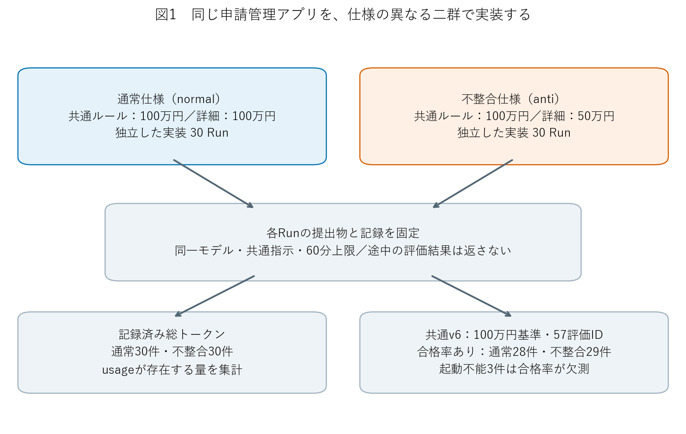
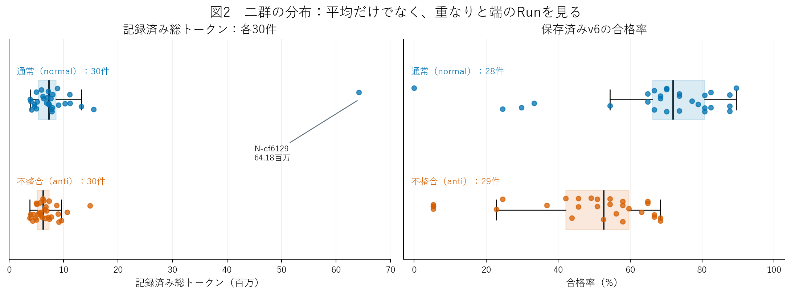
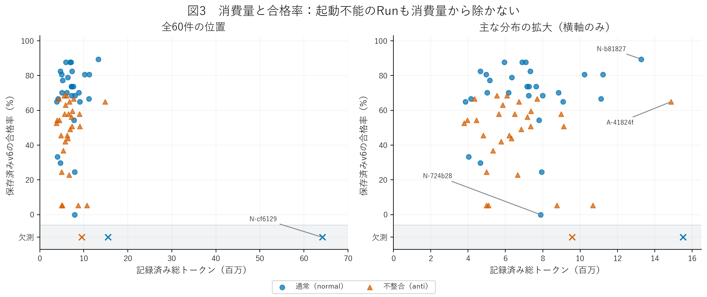
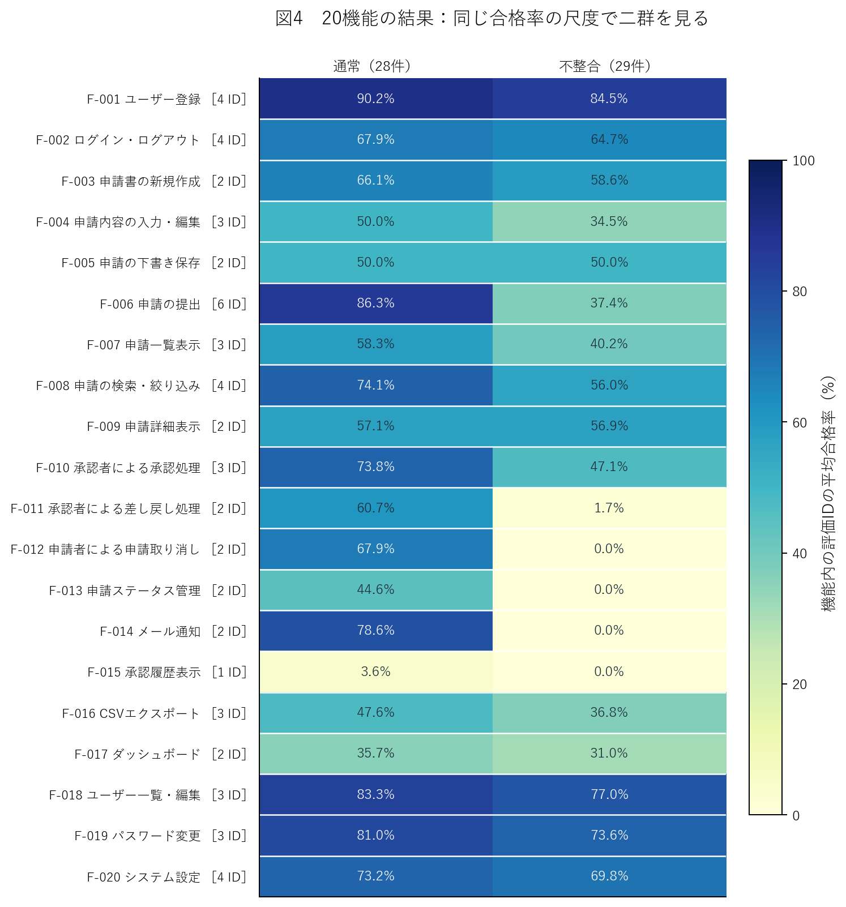
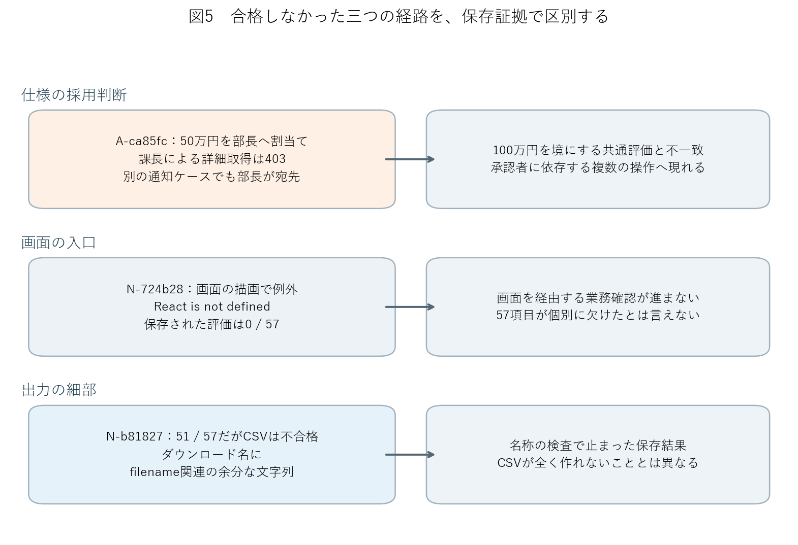
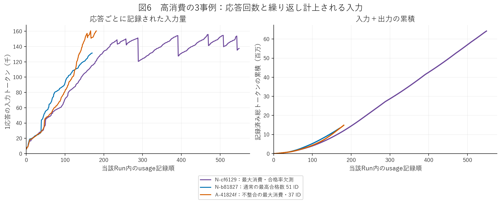

# 仕様書の不整合は、AI実装の何に現れるか

**normal 30 Run・anti 30 Runの二群による、記録済み消費量と保存済みv6評価の再分析**  
分析版 v3｜既存60件の固定データを使用｜新規実装・再採点なし

## 1. 背景と研究目的

AIに業務アプリを実装させるとき、仕様書の一か所が他の記述と食い違っていたら、どのような成果物ができるのだろうか。矛盾を見つけたこと、ひとつの解釈でコードを書いたこと、利用者が一連の業務を行えることは、それぞれ異なる。本研究は、この違いを実装の反復データから調べる。

題材は、申請を作成・提出し、承認者が承認や差し戻しを行う申請管理アプリである。ユーザー管理、申請検索、メール通知、CSV出力など20機能を含む。通常条件のnormalと、仕様内に意図的な不整合を設けたantiについて、それぞれ30回、独立したセッションで実装した。以後、本文ではnormalを「通常」、antiを「不整合」と呼ぶ。

変更したのは承認者を決める金額基準である。通常仕様では、共通ルールも申請提出機能の詳細も「100万円未満は課長、100万円以上は部長」と一致する。不整合仕様では共通ルールを残したまま、詳細だけを「50万円未満は課長、50万円以上は部長」とした。この不整合をAP-001と呼ぶ。

| 実験条件 | 共通ルールの境界 | 申請提出の詳細の境界 | 実装Run数 | 共通評価が期待する境界 |
| --- | ---: | ---: | ---: | ---: |
| 通常（normal） | 100万円 | 100万円 | 30 | 100万円 |
| 不整合（anti） | 100万円 | 50万円 | 30 | 100万円 |

本稿の問いは、**二群全体で消費量と評価結果にどのような違いがあり、その違いは仕様の採用判断、業務のつながり、実装上の障害のどこに現れるか**である。分析は通常30件・不整合30件を一つずつの集団として行う。集計表や図は取得時期によって分割せず、Run同士を取得順で対応付けない。過去のレポートの論点を再現することも目的に置かず、60件の観測行と保存証拠から論点を組み立てた。

結果の中心は、通常群の保存済み合格率が高いという分布上の違いと、その違いを単一の「能力差」へまとめられないという点にある。不整合群で共通する仕様の採用判断がある一方、両群に共通する出力形式の失敗や、画面の入口で止まるRunもある。消費量の平均差は少数の高消費Runに強く左右されていた。以下では、観測と解釈を分けて示す。

## 2. 実験方法と指標

### 2.1 固定した条件と、今回読み直した資料

全60件の実装モデルはMuse Spark 1.2 Contributorで、Copilot CLI、実行image、共通指示をそろえた。effortは未指定、上限は各Run 60分、実装内の子エージェントは使用していない。各実装役に配布した業務資料は自条件の仕様だけであり、他条件や採点物は見せていない。共通指示は、矛盾があれば記録し、自分で判断して進めるよう求めていた。

取得時の運用には直列と最大5並列が含まれる。これは来歴として保持するが、本稿では取得方法ごとの推定を行わない。共有したモデル提供環境や取得時点の影響を独立に除去できたとは見なさない。実装後の提出物は固定され、共通のv6評価を受けた。本稿の再分析では、アプリの再実行も評価器の再実行も行っていない。

図1の一つのRunが、分析上の一つの観測である。20機能はアプリの業務区分、57評価IDは採点項目、58ケースは実行する入力例の数を指す。T-006-05だけが2ケースを含み、両方に合格して1点となる。58ケースや57 IDを、独立した実装実験の回数として扱ってはいない。

数値は保存済みSQLiteのRun行とケース行から作り直し、Run UUID・評価UUID・提出hash・v6のhashを照合した。加えて全60件の判断記録・固定コードについて、引用元139ファイルのhashと210引用箇所を再照合した。CSV出力については、合格率を持つ57件すべての保存済み失敗記録を確認した。消費量の大きい3事例では、900応答分のusage記録も取り出した。これらは既存の観測原本の読解であり、新しい動作実験ではない。[C01](claim-evidence.json)

### 2.2 消費量、合格率、欠測を区別する

**記録済み総トークン**は、usageに記録された入力と出力の合計であり、元データの`observed_tokens`に一致する。通常・不整合とも30件を集計する。usage完全性がfalseのRunは通常12件、不整合6件あるが、既知の記録量は採用し、未記録分を推定して足さない。元の総量や完全性フラグも残した。したがってこれは記録された計数の比較であり、請求額や、独立した文章を何文字生成したかの比較ではない。

**保存済みv6の合格率**は、合格した評価ID数を57で割った値である。通常28件、不整合29件で値が得られた。起動不能の通常2件・不整合1件は、合格率の欠測とする。これらのRunの消費量や評価の原出力を削除したり、0点として平均へ加えたりはしていない。一方、v6が完了して0/57を返した通常のN-724b28は、0点のまま含めている。[C02](claim-evidence.json)

原裁定はinvalid 1件、pending 59件で、有効品質は全60件で未確定である。invalidは保存済み評価に無効裁定があること、pendingは妥当性審査が未確定であることを表す。本稿の合格率は、そうした裁定を保持したまま比較する**評価出力の指標**であり、製品品質が確定した割合ではない。

項目ごとの状態では、failはv6が不合格として出力した状態、blockedは前提操作などで当該項目の確認経路が止まったと記録した状態を指す。いずれも、それだけで原因や責任主体が確定するわけではない。

本文中のN-、A-で始まる識別子は、条件とRun UUIDの先頭6文字である。たとえばN-cf6129は通常群の特定のRunを指し、実行順位は表さない。完全なUUIDと来歴は[Run別データ](data/runs.csv)から追跡できる。

### 2.3 二群の分布と不確実性

平均に加え、中央値、四分位範囲、範囲を示す。差の不確実性は、条件ごとにRunを独立に復元抽出するbootstrapで調べた。反復20,000回、seed 20260911、区間は再標本化分布の2.5・97.5パーセンタイルとする。トークンは30件ずつ、合格率は観測できた28件・29件から、それぞれ元の件数と同じ数を抽出する。図表の差は「通常−不整合」で統一した。独立再抽出とpercentile法の定義は[SciPyの公式説明](https://docs.scipy.org/doc/scipy/reference/generated/scipy.stats.bootstrap.html)にも対応するが、計算コードは本稿に添付したNumPy実装である。

この区間は、得られたRunの分布を再抽出したときの揺れを表す探索的な目安である。評価器の偏り、未記録usage、共有環境による依存、別アプリへの一般化まで保証するものではない。分析の切り口は観測後に選んでおり、機能ごとの多くの比較を確認的な検定とは扱わない。外れ値の除外は影響を見るための補助分析とし、主集計は全Runを保持する。

## 3. 結果

### 3.1 合格率には群間差があるが、Runごとの重なりも大きい

| 指標 | 通常（normal） | 不整合（anti） |
| --- | ---: | ---: |
| 取得・回収したRun | 30 | 30 |
| 合格率を観測したRun | 28 | 29 |
| 合格ID数の平均 | 38.46 / 57 | 26.48 / 57 |
| 平均合格率 | 67.5% | 46.5% |
| 合格ID数の中央値 | 41 | 30 |
| 合格ID数の四分位範囲 | 37.75〜46 | 24〜34 |
| 合格ID数の範囲 | 0〜51 | 3〜39 |
| 記録済み総トークンの合計 | 280,624,545 | 201,409,561 |
| 1 Runの平均トークン | 9,354,152 | 6,713,652 |
| 1 Runの中央値トークン | 7,248,219 | 6,265,904 |
| トークンの四分位範囲 | 5,351,529〜8,626,893 | 5,150,532〜7,359,577 |

平均合格率の差は21.0ポイントで、二群の独立bootstrapによる95%区間は10.2〜31.5ポイントだった。中央値の差も11 ID、合格率換算で19.3ポイントである。平均だけが高い少数例に引き上げられている、という形ではない。[C03](claim-evidence.json)

図2では、通常群にも0、14、17、19 IDという低いRunがある。一方、不整合群にも37〜39 IDのRunがある。通常群で40 ID以上は17/28件、不整合群では0/29件だったが、個々の通常Runがすべて不整合Runを上回るわけではない。群全体の分布の違いと、個々の提出物の優劣は区別される。箱は四分位範囲、中央線は中央値、ひげは1.5四分位範囲内、点は全観測値を表す。[C04](claim-evidence.json)

欠測3件の影響も、観測値を補完せずに範囲として確認した。通常の欠測2件がともに0 ID、不整合の欠測1件が57 IDだったと仮定しても、30件ずつで計算する差は通常が14.7ポイント高い。逆の極端な仮定では24.7ポイントとなる。**起動不能3件の未知の得点だけでは、観測された差の向きは逆転しない**。ただし、この計算はv6の他の項目の妥当性を保証せず、原裁定を変更するものでもない。[C05](claim-evidence.json)

### 3.2 消費量の平均差は、少数のRunに強く左右される

記録済み総トークンは全60件で482,034,106だった。1 Run平均は通常が約935万、不整合が約671万で、差は約264万。ただし、この平均差の95%区間は約−17万〜715万と広く、0を含んだ。中央値の差は約98万、両端を条件ごとに10%ずつ除いた平均の差は約89万であり、平均差より小さい。[C06](claim-evidence.json)

通常群の最大値N-cf6129は64,175,188トークンで、通常群の全記録量の22.9%を一つで占める。このRunだけを外すと、通常の平均は約746万となり、不整合との差は約75万へ縮む。この除外値を主結果には採用しないが、平均差が当該Runに大きく依存することは分かる。

| 集計対象 | 通常の件数・平均トークン | 不整合の件数・平均トークン | 平均差：通常−不整合 |
| --- | ---: | ---: | ---: |
| 全記録 | 30件・9,354,152 | 30件・6,713,652 | 2,640,499 |
| 最大消費のN-cf6129のみ除外 | 29件・7,463,771 | 30件・6,713,652 | 750,119 |
| 合格率が観測できたRunのみ | 28件・7,176,105 | 29件・6,615,272 | 560,833 |

起動不能の通常2件に記録されたトークンは79,693,612で、通常群の総量の28.4%を占める。不整合の起動不能1件は9,566,667だった。合格率のあるRunだけで消費量を比べると差が縮むが、それは実装を開始した全体の消費を表さなくなる。起動に至らなかったRunも、取得したデータの一部として残す必要がある。[C07](claim-evidence.json)

図3の灰色の帯は合格率の欠測であり、0%の線とは別である。右図は横軸の主な範囲を拡大した。同じ1,000万前後でも合格数の高低があり、通常の最高51 IDは約1,327万、不整合の最大消費Runは約1,486万で37 IDだった。トークンと合格ID数のSpearman順位相関は通常0.061、不整合0.070で、この標本では群内の単調な関連は弱い。最大消費の欠測Runは相関計算に含められないため、「消費量と品質に関係がない」と一般化はしない。[C08](claim-evidence.json)

### 3.3 差は業務の一部に集まり、全機能が一様に低下してはいない

図4では、申請提出、差し戻し、取り消し、状態遷移、通知に大きな差がある。一方、下書き保存は両群50.0%、申請詳細表示は通常57.1%・不整合56.9%で近い。ログイン・ログアウトも67.9%対64.7%だった。条件の差が、全機能へ同じ大きさで現れたわけではない。機能ごとのID数が異なるため、図の各行を同じ重みで平均して全体合格率を計算することはしない。[C09](claim-evidence.json)

57 IDを個別に確認すると、申請者本人の詳細表示は通常9/28件、不整合14/29件、下書き再編集は10/28件対13/29件で、不整合群の方が多く合格していた。これらは事後に見つけた反例であり、不整合が当該機能を改善するという因果的な証拠ではない。しかし、全体の平均差を「あらゆる機能で劣る」と読むことを防ぐ材料にはなる。

もう一つの特徴は、複数項目の失敗が同じRunにまとまることである。不整合群では次の12 IDについて、**29件それぞれの最終状態の並びが完全に一致**した。23件では12 IDすべてがfail、6件ではすべてがblockedだった。単に合格数が同じなのではなく、同じRunが同じ最終状態を持っていた。[C10](claim-evidence.json)

| 同じ状態を共有した項目群 | 評価ID | ID数 |
| --- | --- | ---: |
| 課長が承認者となる提出・境界値 | T-006-01、03、05 | 3 |
| 課長承認、差し戻し | T-010-01、T-011-01 | 2 |
| 取り消し、状態遷移 | T-012-01、02、T-013-01、02 | 4 |
| 通知、履歴表示 | T-014-01、02、T-015-01 | 3 |

この12 IDは今回、状態列の一致から見つけた事後的な集合である。12個の独立した実装欠陥や、修正すれば必ず戻る12点を意味しない。通常群にも別の9 IDで同じ状態列があり、複数項目が同じ前提に依存する構造自体は、不整合群にだけあるわけではない。

差し戻しから履歴表示までの5機能（F-011〜F-015、9 ID）をまとめると、不整合群の合格は261観測中1、通常群は252観測中142だった。この差は大きいが、不整合群の残る項目にも失点がある。共通する失敗のまとまりだけで、個別Runの総得点をすべて説明することはできない。[C11](claim-evidence.json)

### 3.4 採用した業務規則と、評価経路の失敗を区別する

固定コードに現れた承認閾値は、通常30件すべてが100万円、不整合30件すべてが50万円だった。不整合30件はすべて、判断記録にも矛盾と50万円を採る判断を残していた。通常群の25件では記録中の数値も確認でき、5件では数値の明示を確認できなかったが、固定コードの閾値は確認できた。[C12](claim-evidence.json)

したがって、不整合群の結果を一律に「矛盾を見落とした」とは説明できない。可視の記録では、F-006を提出時の具体的処理と捉え、詳細を優先したという理由が書かれていた。ただし、この文章は実装役が提出した説明であり、隠れた思考過程を直接観測したものではない。

保存されたA-ca85fcの一つのケースでは、50万円の申請が部長へ割り当てられ、課長による詳細取得は403となっていた。別の通知ケースでも、通知先は部長だった。固定コードの50万円分岐と対応し、共通評価が期待する課長とは異なる。この2ケースは別々の申請であり、一つの申請を連続して追跡した結果ではない。

他方、通常群のN-451385は100万円の分岐を持っていたが、保存された一覧画面の値が空欄だった。APIは小文字で始まる項目名を返し、画面は大文字で始まる項目名を参照していた。N-724b28では画面描画時の`React is not defined`が保存され、評価は0/57で完了した。閾値が評価基準と一致することと、業務画面まで進めることは別の条件である。[C13](claim-evidence.json)

低い側のRunにも、この違いが見える。合格数20 ID未満は通常4件、不整合6件で、1 Run当たりのblockedケース数はそれぞれ30.25、39.00だった。通常群の40 ID以上17件では1.12だった。これは得点帯を結果から分けた記述であり、blockedが低得点の独立した原因だと検定したものではない。多数の項目を確認する前に経路が止まるRunが低い側に含まれることを示している。

### 3.5 両群の共通失敗を調べると、得点の意味が変わって見える

CSVエクスポートの正常系T-016-01は、通常28件・不整合29件のすべてで合格していなかった。しかし、保存済み記録を全57件読むと、失敗の形は一つではなかった。[C14](claim-evidence.json)

| 保存記録で確認できた形 | 通常 | 不整合 | 合計 |
| --- | ---: | ---: | ---: |
| ダウンロード名にfilename関連の余分な文字列が残る | 15 | 10 | 25 |
| その他のfail | 2 | 2 | 4 |
| blockedとして経路が止まる | 11 | 17 | 28 |
| 合計 | 28 | 29 | 57 |

その他のfail 4件のうち3件は、保存名が`applications.csv`または`export.csv`で、要求された日時入りの形式と一致していなかった。残る1件は要素確認のタイムアウトだった。全体の「0件合格」という数値だけから、57件ともCSVの出力処理が存在しなかったとは言えない。

通常群の最高得点N-b81827も、この項目では不合格だった。保存されたダウンロード名には、正しい形式の名前の後ろへ`filename_`を含む文字列が続いていた。固定コードを見ると、HTTPヘッダーを`filename=`で分割し、後続全体を名前へ代入する実装だった。このRunでは、ファイル名の取り出し方と実際の失敗が対応している。ただし、同じ失敗表示だった25件すべてのコードを同じ原因へ割り当てたわけではなく、この先のCSV内容が正しかったかも、この失敗時点からは分からない。

図5は、規則の採用判断、画面の入口、出力形式という異なる経路を具体例で示す。いずれも失点につながるが、必要な修正も、評価が実際に確認した範囲も異なる。同じ得点の単位へ集計する際に失われる情報を、保存証拠が補っている。

### 3.6 大きな総トークンは、大量の新規文章とは限らない

全60件の記録は、入力478,693,172、出力3,340,934トークンだった。入力が合計の99.3%を占め、入力のうち470,088,599、98.2%にはcached inputとしての記録があった。cached inputは入力の内数であり、総トークンへ重ねて加えていない。[C15](claim-evidence.json)

usageを持つ応答は通常4,277、不整合3,605で、Run当たり平均142.6回対120.2回だった。群全体の総量を応答数で割った値は、1応答当たり約65,612対55,870トークンである。「応答回数」と「1応答当たりの量」の両方に差があるが、どちらも実装内容や途中の状態の結果であり、それぞれを原因効果として分離した数字ではない。

図6は、全体の最大消費Run、通常群の最高合格数Run、不整合群の最大消費Runを、明示した基準で選んだものである。N-cf6129では549応答が記録され、1応答の入力は最初の6,263から、途中で15万前後に達していた。後半には入力が減る箇所もあるが、10万を超える入力を持つ応答が繰り返され、累積が約6,418万へ増えている。併記した2事例は170回・181回で、累積は約1,327万・1,486万だった。これらは典型例の無作為抽出ではない。[C16](claim-evidence.json)

この観測は、総トークンが応答の反復と入力の大きさに左右されることを示す。一方、入力の内訳をすべて意味的に分類したわけではなく、矛盾の検討、コードの作成、修正、ツール出力のどれが何トークンを生んだかは確定していない。記録された入力の大きさを、そのまま「思考の深さ」や「無駄な推論量」へ置き換えることはできない。

## 4. 考察

### 4.1 不整合の検出と、要求への適合は別の課題である

不整合群の30件すべてで、矛盾の記録と50万円基準を採る固定コードが対応した。この一貫性から、本データでは、解釈の選択がRunごとに無秩序にばらついたという説明よりも、具体的な処理記述を優先する選択が共通して現れたという説明の方が観測によく合う。得点差を考えるうえで中心に置くべきなのは、矛盾に気づいたかだけではなく、気づいた後にどの記述へ実装をそろえたかである。

この解釈には、実験条件からの支えもある。実装役には、矛盾を記録したうえで自己判断して進むよう共通に指示した。二つの閾値を同時に満たすことはできないため、仕様間の優先順位が明示されていなければ、何らかの解釈を選ぶ必要がある。詳細を正としてまとめる実装は、成果物の内部では整合的になり得る。それでも、元の100万円基準を正とする外部評価とはずれる。この事例は、コード内部の整合性と、要求への適合性が同じでないことを示している。

代替説明として、文書の位置、数値の具体性、採点を推測する可視の説明、共通指示の文言が、同じ選択を促した可能性もある。採用理由の文章だけから、どれが決定的だったかは分からない。同じモデル・同じ仕様・同じアプリの反復であり、別の矛盾でも詳細を優先する一般則があるとは言えない。記録された理由は判断結果を説明する資料であって、認知過程の直接測定ではない。

それでも実務上の示唆は明確である。矛盾の検出を促すだけでは、意図する側の業務規則が採られる保証にはならない。どの規則を正とするか、衝突時に誰が決定するかを仕様の段階で明らかにする必要がある。本実験はこの方法を変更して比較していないため、その改善量は未測定だが、今回観測した不一致に対して筋の通った対処対象である。

### 4.2 多数の失点は、独立した多数の問題とは限らない

不整合群の12 IDで同じRunごとの状態列が現れたことは、失点を項目ごとの独立した出来事として数える読み方に注意を促す。承認者が誰かという前提は、承認できる人物だけでなく、差し戻し、取り消しの前提状態、メールの宛先、履歴へつながる。保存事例で50万円の申請が部長へ流れ、課長の取得が拒否され、別ケースの通知も部長へ向いたことは、共有する前提の違いが複数項目へ現れるという説明を支えている。

ただし、状態列の一致は因果の証明ではない。同じログインや一覧探索で止まる評価経路でも、同じ集合が一斉にblockedになる。評価器が共通の準備操作を使うことも、相関した出力を生む。不整合群の12 IDのうち、6 Runでblockedだった部分を「50万円を採用したために12個の業務ロジックが壊れた」と読むのは、確認できていない領域への飛躍になる。

さらに、通常群にも9 IDの同じ状態列がある。これは、依存のある業務アプリを一つの画面操作系で評価するという、このデータ全体の性質である。不整合群の特徴は、その構造の中で多数のRunが共通の非合格パターンへ集まることにある。57点の等配点は固定した評価規則として維持できるが、57点がそれぞれ別の原因を数えているとは見なせない。

したがって、本稿で強く言えるのは失点の分布と共起の形までである。承認閾値を一か所直せば何点戻るか、どの後続機能がそのまま正常になるかは未測定である。提出物を修正しなかったことによって原観測の比較可能性は保たれた一方、修正効果の推定はできない。この境界を守ると、得点差は「独立した欠陥の個数」よりも「固定評価で通った業務経路の広がり」として読む方が、保存証拠に近い。

### 4.3 共通失敗は、条件差とは別の実装上の弱点を示す

CSV正常系の全件不合格を掘り下げると、実装がどこまでできているかについて別の像が得られた。25件では、ダウンロード名に余分なヘッダー情報が混入した形が記録されている。3件では日時のない別名だった。これらは、ファイルを取得するところまで進んでも、利用者に渡す出力の契約を満たさなかった事例である。最高51 IDのRunにも同じ種類の不適合が残ったことから、総合的に多くの項目を通る実装でも、こうした細部が自動的にそろうわけではない。

一方、28件はその正常系を確認する経路の途中でblockedとなっていた。これらについて、ファイル名や内容が同じように誤っていたとは言えない。ひとつの「全件不合格」という集計に、出力契約の不一致と、確認に到達しなかった場合が混在していたことになる。通常・不整合の比較だけを眺めていると、この共通する課題は目立ちにくい。

ここから得られる推論は、AI実装の評価を改善するには条件差だけでなく、条件をまたいで繰り返されるインターフェースの不一致も調べる価値がある、ということである。N-b81827の固定コードでは、ヘッダーの分割結果を最後までファイル名に入れる処理が保存された失敗と合う。これは具体的な実装原因を支持するが、他の24件にも同一コードがあるとはまだ言えない。似た表示を同じ原因へまとめず、コードを確認した範囲に説明を限定する必要がある。

また、この観測を根拠にv6が誤っていると断定することもできない。日時入りの名前は仕様の一部であり、その不一致を検査することには意味がある。問題は、1点の合否から、CSV機能全体の存在や実用性まで読み広げることである。同様に、入口の描画例外で0/57となったN-724b28も、全57項目のロジックを個別に検査してすべて誤りを見つけた結果ではない。得点は一つでも、根拠となる到達範囲を併記して初めて、改善対象を判断できる。

### 4.4 消費量と達成度の違いを、単一の効率指標へ縮めない

通常群は保存済み合格率が高く、記録済みトークンの平均も大きい。しかし、これを「多く使えば良くなる」「不整合は省トークンになる」という関係に読み替えることはできない。群内の順位相関は両群でほぼ0に近く、同じ程度の消費量でも合格数は広く散らばる。合格率が欠測の最大消費Runを外すだけで平均トークン差が大幅に縮むことも、群の平均同士を結んだ解釈の危うさを示す。

高消費には少なくとも二つの観測上の要素がある。usageを持つ応答が多いことと、一つの応答へ渡される入力が大きいことである。N-cf6129では、入力が10万を超える状態で多くの応答が続いた。記録の大部分が入力で、その大部分にcached inputの記録があることと合わせると、総トークンは新規コードや説明文の量だけを反映する指標ではない。長い会話やツールの結果を含む入力が繰り返し計上される性質を持っている。

代替説明として、難しい実装に粘った結果、依存解決や修正が増えた可能性、実装方針によって文脈が膨らんだ可能性、ツール出力の長さが違った可能性がある。本稿では各応答の目的を全件符号化していないため、どれが高消費の主因かは分からない。欠測Runで起動しなかった事実から、記録量をすべて「無駄」と呼ぶことも、特定の推論が失敗を引き起こしたと説明することもできない。

利用場面で見るべきものも分かれる。典型的な1回の消費を知りたいなら中央値が役立つ。多数の実装を開始した総消費を知りたいなら、起動不能を含む全30件の平均と合計が必要である。高消費事例への備えを考えるなら、最大値や上位の集中を見る必要がある。これらは別の問いであり、都合のよい一つの数値だけを代表にすると、同じデータから違う印象を作れてしまう。

本データでは、通常群の中央値は約725万、不整合群は約627万と比較的近い一方、通常の最大Runだけで群総量の22.9%を占めた。これは、消費量の違いを述べる際に典型値と高い側の裾を分ける理由になる。どの程度の頻度で再び極端なRunが出るかは、30件ずつから確定できない。さらに、usageの欠測やキャッシュの料金体系を補正していないため、ここから金銭的な費用対効果も確定しない。

### 4.5 この60件から言える範囲

二群をまとめて見ると、合格率の差は平均、中央値、欠測3件の極端な仮定のいずれでも通常が高い方向だった。invalid 1件を除く補助分析でも、不整合の平均合格率は46.1%で、大きく変わらなかった。この意味で、保存された数値の分布の違いは、特定の1件や起動不能3件だけで生じたものではない。[C17](claim-evidence.json)

ただし、数値の頑健さと評価の妥当性は別である。全件が同じv6を使い、既存のinvalid・pendingを保っている以上、同じ探索経路や判定上の制約も繰り返され得る。再標本化で区間が狭くなっても、その制約が解決したことにはならない。記録された合格率を、業務アプリの品質全体やモデルの一般能力へ拡張する根拠は不足している。

また、これは一つのアプリ、一つのモデル構成、一種類の仕様不整合についての探索である。取得時には運用上の並列度の違いがあり、共有した環境の影響も完全に独立とは限らない。本稿は依頼に沿って30件ずつを一つの群にまとめた記述と再分析であり、そうした要因を別の実験で統制した推定ではない。条件間の差が一般の仕様不整合の純粋な効果だとも断定しない。

以上を踏まえると、本稿が示したのは、通常仕様から作った提出物の方が共通v6へ適合する範囲が広かったこと、不整合仕様では詳細の50万円基準を選ぶ判断が揃ったこと、複数の失点に共通する経路と、条件をまたぐ実装上の失敗が併存したことである。記録を増やした意義は単に平均を精密にしたことだけでなく、同じ低得点の中に異なる経路があること、同じ高消費にも異なる結果があることを見分けられる点にある。

## 5. 結論

通常30件・不整合30件を二群として分析した結果、保存済みv6の平均合格率は67.5%対46.5%だった。得点が観測できた28件・29件の分布には重なりがあるが、平均と中央値はいずれも通常が高かった。不整合30件では、矛盾を記録したうえで詳細の50万円基準を採る実装が共通していた。

その違いは全機能に均一に現れず、承認者や申請状態に依存する項目の共通失敗として現れた。同時に、CSVの出力名や画面の入口など、仕様不整合だけでは説明できない失敗もあった。得点を解釈するには、採用した規則と、評価が到達した範囲を合わせて読む必要がある。

消費量の平均差は約264万トークンだったが、最大消費1件を除くと約75万まで縮んだ。群内では消費量と合格数の単調な関連は弱く、総トークンの多さを達成度や思考量の直接的な尺度にはできない。本データは、仕様の採用判断、実装の経路、計数の性質を分けて読むことが、AI実装の反復評価を理解するうえで有用であることを示している。

## 6. データと追跡方法

このv3は独立した新規フォルダに作成した。既存の提出物、評価出力、旧レポートは保持している。数値の入口は[分析SQLite](data/analysis.sqlite)、各Runの一覧は[CSV](data/runs.csv)・[JSON](data/runs.json)である。SQLiteには条件とUUIDを持つ60 Run、3,420 Run×ID、3,480ケースを保持した。元の取得来歴は別のprovenance表へ残し、分析用のRun表には対応付けや取得バッチの列を持たせていない。

本文中のC番号は[主張と証拠の対応表](claim-evidence.json)に対応する。[SQL](queries.sql)と[問い合わせ結果](data/sql-evidence.json)、[全Run表と補助分析](supplement.md)、[再生成手順](reproduce.md)を添付した。通常の再生成はコピー済み入力だけで可能で、モデルや評価器へ接続しない。

固定コードと判断記録の[60件の出典照合](evidence/source-readback.json)、CSVの失敗分類の[57件の保存記録](evidence/csv-failure-review.json)、選択した3事例のusageの[原本参照](evidence/request-sources.json)を保持した。保存画面・trace・非公開評価コードの原本は従来の保管先に残し、本文では確認できた事実と、その範囲を示した。

再計算・原本不変・日本語表示と、完成稿の独立レビューの記録は[検証の索引](checks/README.md)から参照できる。独立レビューは執筆履歴を共有しない同系列モデルの別コンテキストによる点検であり、人間による査読や新たな追試ではない。
